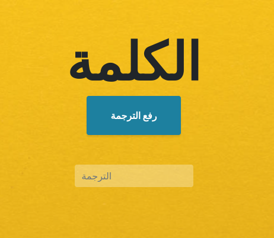

# خطة مشروع تُرجمان

مشروع ترجمان هو مشروع يمكن المستخدمين من التَّرْجَمَةً من داخل منصتهم المفضلة, سواء منصة محادثة مثل Telegram او Matrix او حتى منصة أخرى.
فالمشروع مقسم لنواة وإضافات.
وعبر جعل التَّرْجَمَةً متوفر للجميع بشكل أسهل, هذا يزيد من وتيرة التَّرْجَمَةً بسرعة, بحيث يصبح مديرين فريق التَّرْجَمَةً يشرفون على الترجمات بدلا من التَّرْجَمَةً بنفسهم.
وهذا سوف يسرع من عملية التَّرْجَمَةً بشكل كبير.

## الأهداف
- تسهيل طريقة التَّرْجَمَةً، عبر توفير واجهات على المنصات المفضلة للمستخدم العادي.
- توفير برمجيات أو أدوات واجهات تسهل من عملية التَّرْجَمَةً
- دعم اللغات الأخرى بالإضافة للغة العربية عن طريق استخدام معيار عالمي مثل i18n
- توثيق مشاركات المستخدم وإظهارها في قائمة المترجمين
- توجيه المستخدم لترجمة أي مشروع عبر نفس الواجهة, فترجمان هو المسؤول عن استخراج الكلمات من اي مشروع.
المستخدم سوف يستقبل الكلمة دون ان يلاحظ اي فرق بطريقة التَّرْجَمَةً

## طريقة عمل مشروع تُرجمان

<img src="data:image/svg+xml;base64,PHN2ZyB4bWxucz0iaHR0cDovL3d3dy53My5vcmcvMjAwMC9zdmciIHhtbG5zOnhsaW5rPSJodHRwOi8vd3d3LnczLm9yZy8xOTk5L3hsaW5rIiB2ZXJzaW9uPSIxLjEiIHdpZHRoPSIxMDcxcHgiIGhlaWdodD0iNzkxcHgiIHZpZXdCb3g9Ii0wLjUgLTAuNSAxMDcxIDc5MSI+PGRlZnMvPjxnPjxwYXRoIGQ9Ik0gMTAwOS45NyAzMzUgTCAxMDA5Ljk3IDM2MiBRIDEwMDkuOTcgMzcyIDk5OS45NyAzNzIgTCA5NDYuMzcgMzcyIiBmaWxsPSJub25lIiBzdHJva2U9IiNmZjYzOTIiIHN0cm9rZS1taXRlcmxpbWl0PSIxMCIgcG9pbnRlci1ldmVudHM9InN0cm9rZSIvPjxwYXRoIGQ9Ik0gOTQxLjEyIDM3MiBMIDk0OC4xMiAzNjguNSBMIDk0Ni4zNyAzNzIgTCA5NDguMTIgMzc1LjUgWiIgZmlsbD0iI2ZmNjM5MiIgc3Ryb2tlPSIjZmY2MzkyIiBzdHJva2UtbWl0ZXJsaW1pdD0iMTAiIHBvaW50ZXItZXZlbnRzPSJhbGwiLz48cmVjdCB4PSI5NTAiIHk9IjMwMCIgd2lkdGg9IjEyMCIgaGVpZ2h0PSIzNSIgcng9IjUuMjUiIHJ5PSI1LjI1IiBmaWxsPSIjZmZlNDVlIiBzdHJva2U9IiNmZjYzOTIiIHBvaW50ZXItZXZlbnRzPSJhbGwiLz48ZyB0cmFuc2Zvcm09InRyYW5zbGF0ZSgtMC41IC0wLjUpIj48c3dpdGNoPjxmb3JlaWduT2JqZWN0IHBvaW50ZXItZXZlbnRzPSJub25lIiB3aWR0aD0iMTAwJSIgaGVpZ2h0PSIxMDAlIiByZXF1aXJlZEZlYXR1cmVzPSJodHRwOi8vd3d3LnczLm9yZy9UUi9TVkcxMS9mZWF0dXJlI0V4dGVuc2liaWxpdHkiIHN0eWxlPSJvdmVyZmxvdzogdmlzaWJsZTsgdGV4dC1hbGlnbjogbGVmdDsiPjxkaXYgeG1sbnM9Imh0dHA6Ly93d3cudzMub3JnLzE5OTkveGh0bWwiIHN0eWxlPSJkaXNwbGF5OiBmbGV4OyBhbGlnbi1pdGVtczogdW5zYWZlIGNlbnRlcjsganVzdGlmeS1jb250ZW50OiB1bnNhZmUgY2VudGVyOyB3aWR0aDogMTE4cHg7IGhlaWdodDogMXB4OyBwYWRkaW5nLXRvcDogMzE4cHg7IG1hcmdpbi1sZWZ0OiA5NTFweDsiPjxkaXYgZGF0YS1kcmF3aW8tY29sb3JzPSJjb2xvcjogIzVBQTlFNjsgIiBzdHlsZT0iYm94LXNpemluZzogYm9yZGVyLWJveDsgZm9udC1zaXplOiAwcHg7IHRleHQtYWxpZ246IGNlbnRlcjsiPjxkaXYgc3R5bGU9ImRpc3BsYXk6IGlubGluZS1ibG9jazsgZm9udC1zaXplOiAxMnB4OyBmb250LWZhbWlseTogSGVsdmV0aWNhOyBjb2xvcjogcmdiKDkwLCAxNjksIDIzMCk7IGxpbmUtaGVpZ2h0OiAxLjI7IHBvaW50ZXItZXZlbnRzOiBhbGw7IHdoaXRlLXNwYWNlOiBub3JtYWw7IG92ZXJmbG93LXdyYXA6IG5vcm1hbDsiPkRpY3Rpb25hcnkgSlNPTiBmaWxlPC9kaXY+PC9kaXY+PC9kaXY+PC9mb3JlaWduT2JqZWN0Pjx0ZXh0IHg9IjEwMTAiIHk9IjMyMSIgZmlsbD0iIzVBQTlFNiIgZm9udC1mYW1pbHk9IkhlbHZldGljYSIgZm9udC1zaXplPSIxMnB4IiB0ZXh0LWFuY2hvcj0ibWlkZGxlIj5EaWN0aW9uYXJ5IEpTT04gZmlsZTwvdGV4dD48L3N3aXRjaD48L2c+PHBhdGggZD0iTSA4ODUgNDE0IEwgODg1IDQ0NC40OCBRIDg4NSA0NTQuNDggODc1IDQ1NC40OCBMIDgxNSA0NTQuNDggUSA4MDUgNDU0LjQ4IDgwNSA0NjQuNDggTCA4MDUgNDg4LjYzIiBmaWxsPSJub25lIiBzdHJva2U9IiNmZjYzOTIiIHN0cm9rZS1taXRlcmxpbWl0PSIxMCIgcG9pbnRlci1ldmVudHM9InN0cm9rZSIvPjxwYXRoIGQ9Ik0gODA1IDQ5My44OCBMIDgwMS41IDQ4Ni44OCBMIDgwNSA0ODguNjMgTCA4MDguNSA0ODYuODggWiIgZmlsbD0iI2ZmNjM5MiIgc3Ryb2tlPSIjZmY2MzkyIiBzdHJva2UtbWl0ZXJsaW1pdD0iMTAiIHBvaW50ZXItZXZlbnRzPSJhbGwiLz48cGF0aCBkPSJNIDg1Ny41IDM1MSBMIDg3Ny4wNSAzMzYuMDcgUSA4ODUgMzMwIDg5Mi45NSAzMzYuMDcgTCA5MzIuMDUgMzY1LjkzIFEgOTQwIDM3MiA5MzIuMDUgMzc4LjA3IEwgODkyLjk1IDQwNy45MyBRIDg4NSA0MTQgODc3LjA1IDQwNy45MyBMIDgzNy45NSAzNzguMDcgUSA4MzAgMzcyIDgzNy45NSAzNjUuOTMgWiIgZmlsbD0iI2ZmZTQ1ZSIgc3Ryb2tlPSIjZmY2MzkyIiBzdHJva2UtbWl0ZXJsaW1pdD0iMTAiIHBvaW50ZXItZXZlbnRzPSJhbGwiLz48ZyB0cmFuc2Zvcm09InRyYW5zbGF0ZSgtMC41IC0wLjUpIj48c3dpdGNoPjxmb3JlaWduT2JqZWN0IHBvaW50ZXItZXZlbnRzPSJub25lIiB3aWR0aD0iMTAwJSIgaGVpZ2h0PSIxMDAlIiByZXF1aXJlZEZlYXR1cmVzPSJodHRwOi8vd3d3LnczLm9yZy9UUi9TVkcxMS9mZWF0dXJlI0V4dGVuc2liaWxpdHkiIHN0eWxlPSJvdmVyZmxvdzogdmlzaWJsZTsgdGV4dC1hbGlnbjogbGVmdDsiPjxkaXYgeG1sbnM9Imh0dHA6Ly93d3cudzMub3JnLzE5OTkveGh0bWwiIHN0eWxlPSJkaXNwbGF5OiBmbGV4OyBhbGlnbi1pdGVtczogdW5zYWZlIGNlbnRlcjsganVzdGlmeS1jb250ZW50OiB1bnNhZmUgY2VudGVyOyB3aWR0aDogMTAwcHg7IGhlaWdodDogMXB4OyBwYWRkaW5nLXRvcDogMzcwcHg7IG1hcmdpbi1sZWZ0OiA4MzVweDsiPjxkaXYgZGF0YS1kcmF3aW8tY29sb3JzPSJjb2xvcjogIzVBQTlFNjsgIiBzdHlsZT0iYm94LXNpemluZzogYm9yZGVyLWJveDsgZm9udC1zaXplOiAwcHg7IHRleHQtYWxpZ246IGNlbnRlcjsiPjxkaXYgc3R5bGU9ImRpc3BsYXk6IGlubGluZS1ibG9jazsgZm9udC1zaXplOiAxMnB4OyBmb250LWZhbWlseTogSGVsdmV0aWNhOyBjb2xvcjogcmdiKDkwLCAxNjksIDIzMCk7IGxpbmUtaGVpZ2h0OiAxLjI7IHBvaW50ZXItZXZlbnRzOiBhbGw7IHdoaXRlLXNwYWNlOiBub3JtYWw7IG92ZXJmbG93LXdyYXA6IG5vcm1hbDsiPlRvcmpvbWFuIENvcmU8L2Rpdj48L2Rpdj48L2Rpdj48L2ZvcmVpZ25PYmplY3Q+PHRleHQgeD0iODg1IiB5PSIzNzQiIGZpbGw9IiM1QUE5RTYiIGZvbnQtZmFtaWx5PSJIZWx2ZXRpY2EiIGZvbnQtc2l6ZT0iMTJweCIgdGV4dC1hbmNob3I9Im1pZGRsZSI+VG9yam9tYW4gQ29yZTwvdGV4dD48L3N3aXRjaD48L2c+PHJlY3QgeD0iOTEwIiB5PSI1Mi41IiB3aWR0aD0iMTE3LjUiIGhlaWdodD0iOTUiIHJ4PSIxNC4yNSIgcnk9IjE0LjI1IiBmaWxsPSJub25lIiBzdHJva2U9Im5vbmUiIHBvaW50ZXItZXZlbnRzPSJhbGwiLz48ZyB0cmFuc2Zvcm09InRyYW5zbGF0ZSgtMC41IC0wLjUpIj48c3dpdGNoPjxmb3JlaWduT2JqZWN0IHBvaW50ZXItZXZlbnRzPSJub25lIiB3aWR0aD0iMTAwJSIgaGVpZ2h0PSIxMDAlIiByZXF1aXJlZEZlYXR1cmVzPSJodHRwOi8vd3d3LnczLm9yZy9UUi9TVkcxMS9mZWF0dXJlI0V4dGVuc2liaWxpdHkiIHN0eWxlPSJvdmVyZmxvdzogdmlzaWJsZTsgdGV4dC1hbGlnbjogbGVmdDsiPjxkaXYgeG1sbnM9Imh0dHA6Ly93d3cudzMub3JnLzE5OTkveGh0bWwiIHN0eWxlPSJkaXNwbGF5OiBmbGV4OyBhbGlnbi1pdGVtczogdW5zYWZlIGNlbnRlcjsganVzdGlmeS1jb250ZW50OiB1bnNhZmUgY2VudGVyOyB3aWR0aDogMTE2cHg7IGhlaWdodDogMXB4OyBwYWRkaW5nLXRvcDogMTAwcHg7IG1hcmdpbi1sZWZ0OiA5MTFweDsiPjxkaXYgZGF0YS1kcmF3aW8tY29sb3JzPSJjb2xvcjogIzVBQTlFNjsgIiBzdHlsZT0iYm94LXNpemluZzogYm9yZGVyLWJveDsgZm9udC1zaXplOiAwcHg7IHRleHQtYWxpZ246IGNlbnRlcjsiPjxkaXYgc3R5bGU9ImRpc3BsYXk6IGlubGluZS1ibG9jazsgZm9udC1zaXplOiAxMnB4OyBmb250LWZhbWlseTogSGVsdmV0aWNhOyBjb2xvcjogcmdiKDkwLCAxNjksIDIzMCk7IGxpbmUtaGVpZ2h0OiAxLjI7IHBvaW50ZXItZXZlbnRzOiBhbGw7IHdoaXRlLXNwYWNlOiBub3JtYWw7IG92ZXJmbG93LXdyYXA6IG5vcm1hbDsiPjxkaXY+REI8L2Rpdj48ZGl2PnN0b3Jpbmcgc3Vic2NyaXB0aW9ucyh3aG8sIGFuZCBob3cgbWFueSB3b3JkcyBwZXIgZGF5KSBhbmQgdHJhbnNsYXRvcnMgSURTPC9kaXY+PC9kaXY+PC9kaXY+PC9kaXY+PC9mb3JlaWduT2JqZWN0Pjx0ZXh0IHg9Ijk2OSIgeT0iMTA0IiBmaWxsPSIjNUFBOUU2IiBmb250LWZhbWlseT0iSGVsdmV0aWNhIiBmb250LXNpemU9IjEycHgiIHRleHQtYW5jaG9yPSJtaWRkbGUiPkRCLi4uPC90ZXh0Pjwvc3dpdGNoPjwvZz48cmVjdCB4PSI5MDAiIHk9IjQyMCIgd2lkdGg9IjEwMCIgaGVpZ2h0PSI1MCIgcng9IjcuNSIgcnk9IjcuNSIgZmlsbD0ibm9uZSIgc3Ryb2tlPSJub25lIiBwb2ludGVyLWV2ZW50cz0iYWxsIi8+PGcgdHJhbnNmb3JtPSJ0cmFuc2xhdGUoLTAuNSAtMC41KSI+PHN3aXRjaD48Zm9yZWlnbk9iamVjdCBwb2ludGVyLWV2ZW50cz0ibm9uZSIgd2lkdGg9IjEwMCUiIGhlaWdodD0iMTAwJSIgcmVxdWlyZWRGZWF0dXJlcz0iaHR0cDovL3d3dy53My5vcmcvVFIvU1ZHMTEvZmVhdHVyZSNFeHRlbnNpYmlsaXR5IiBzdHlsZT0ib3ZlcmZsb3c6IHZpc2libGU7IHRleHQtYWxpZ246IGxlZnQ7Ij48ZGl2IHhtbG5zPSJodHRwOi8vd3d3LnczLm9yZy8xOTk5L3hodG1sIiBzdHlsZT0iZGlzcGxheTogZmxleDsgYWxpZ24taXRlbXM6IHVuc2FmZSBjZW50ZXI7IGp1c3RpZnktY29udGVudDogdW5zYWZlIGNlbnRlcjsgd2lkdGg6IDk4cHg7IGhlaWdodDogMXB4OyBwYWRkaW5nLXRvcDogNDQ1cHg7IG1hcmdpbi1sZWZ0OiA5MDFweDsiPjxkaXYgZGF0YS1kcmF3aW8tY29sb3JzPSJjb2xvcjogIzVBQTlFNjsgIiBzdHlsZT0iYm94LXNpemluZzogYm9yZGVyLWJveDsgZm9udC1zaXplOiAwcHg7IHRleHQtYWxpZ246IGNlbnRlcjsiPjxkaXYgc3R5bGU9ImRpc3BsYXk6IGlubGluZS1ibG9jazsgZm9udC1zaXplOiAxMnB4OyBmb250LWZhbWlseTogSGVsdmV0aWNhOyBjb2xvcjogcmdiKDkwLCAxNjksIDIzMCk7IGxpbmUtaGVpZ2h0OiAxLjI7IHBvaW50ZXItZXZlbnRzOiBhbGw7IHdoaXRlLXNwYWNlOiBub3JtYWw7IG92ZXJmbG93LXdyYXA6IG5vcm1hbDsiPlBpY2sgd2hpY2ggd29yZHMgbmVlZCB0cmFuc2xhdGlvbizCoDxiciAvPmFuZCBwdXNoIHRoZXNlIHdvcmRzIHdpdGggdGhlIGN1cnJlbnQgdHJhbnNsYXRpb24gdG8gdGhlIEFQSTwvZGl2PjwvZGl2PjwvZGl2PjwvZm9yZWlnbk9iamVjdD48dGV4dCB4PSI5NTAiIHk9IjQ0OSIgZmlsbD0iIzVBQTlFNiIgZm9udC1mYW1pbHk9IkhlbHZldGljYSIgZm9udC1zaXplPSIxMnB4IiB0ZXh0LWFuY2hvcj0ibWlkZGxlIj5QaWNrIHdoaWNoIHdvcmRzLi4uPC90ZXh0Pjwvc3dpdGNoPjwvZz48cGF0aCBkPSJNIDI3Mi41MiA0NTAgTCAyNzIuNTIgNDYwIFEgMjcyLjUyIDQ3MCAyNzIuNTIgNDY5LjMyIEwgMjcyLjUyIDQ2OC42MyIgZmlsbD0ibm9uZSIgc3Ryb2tlPSIjZmY2MzkyIiBzdHJva2UtbWl0ZXJsaW1pdD0iMTAiIHBvaW50ZXItZXZlbnRzPSJzdHJva2UiLz48cGF0aCBkPSJNIDI3Mi41IDQ3My44OCBMIDI2OS4wMyA0NjYuODcgTCAyNzIuNTIgNDY4LjYzIEwgMjc2LjAzIDQ2Ni45IFoiIGZpbGw9IiNmZjYzOTIiIHN0cm9rZT0iI2ZmNjM5MiIgc3Ryb2tlLW1pdGVybGltaXQ9IjEwIiBwb2ludGVyLWV2ZW50cz0iYWxsIi8+PHJlY3QgeD0iMjAyLjI1IiB5PSIzOTAiIHdpZHRoPSIxNDAuNSIgaGVpZ2h0PSI2MCIgcng9IjkiIHJ5PSI5IiBmaWxsPSIjZmZlNDVlIiBzdHJva2U9IiNmZjYzOTIiIHBvaW50ZXItZXZlbnRzPSJhbGwiLz48ZyB0cmFuc2Zvcm09InRyYW5zbGF0ZSgtMC41IC0wLjUpIj48c3dpdGNoPjxmb3JlaWduT2JqZWN0IHBvaW50ZXItZXZlbnRzPSJub25lIiB3aWR0aD0iMTAwJSIgaGVpZ2h0PSIxMDAlIiByZXF1aXJlZEZlYXR1cmVzPSJodHRwOi8vd3d3LnczLm9yZy9UUi9TVkcxMS9mZWF0dXJlI0V4dGVuc2liaWxpdHkiIHN0eWxlPSJvdmVyZmxvdzogdmlzaWJsZTsgdGV4dC1hbGlnbjogbGVmdDsiPjxkaXYgeG1sbnM9Imh0dHA6Ly93d3cudzMub3JnLzE5OTkveGh0bWwiIHN0eWxlPSJkaXNwbGF5OiBmbGV4OyBhbGlnbi1pdGVtczogdW5zYWZlIGNlbnRlcjsganVzdGlmeS1jb250ZW50OiB1bnNhZmUgY2VudGVyOyB3aWR0aDogMTM5cHg7IGhlaWdodDogMXB4OyBwYWRkaW5nLXRvcDogNDIwcHg7IG1hcmdpbi1sZWZ0OiAyMDNweDsiPjxkaXYgZGF0YS1kcmF3aW8tY29sb3JzPSJjb2xvcjogIzVBQTlFNjsgIiBzdHlsZT0iYm94LXNpemluZzogYm9yZGVyLWJveDsgZm9udC1zaXplOiAwcHg7IHRleHQtYWxpZ246IGNlbnRlcjsiPjxkaXYgc3R5bGU9ImRpc3BsYXk6IGlubGluZS1ibG9jazsgZm9udC1zaXplOiAxMnB4OyBmb250LWZhbWlseTogSGVsdmV0aWNhOyBjb2xvcjogcmdiKDkwLCAxNjksIDIzMCk7IGxpbmUtaGVpZ2h0OiAxLjI7IHBvaW50ZXItZXZlbnRzOiBhbGw7IHdoaXRlLXNwYWNlOiBub3JtYWw7IG92ZXJmbG93LXdyYXA6IG5vcm1hbDsiPlVwZGF0ZSBUcmFuc2xhdGlvbiBpbiAoZGljdGlvbmFyeSkgSlNPTiBmaWxlIFVzaW5nIHRoZSBtb3N0IHBvcHVsYXIgdHJhbnNsYXRpb248L2Rpdj48L2Rpdj48L2Rpdj48L2ZvcmVpZ25PYmplY3Q+PHRleHQgeD0iMjczIiB5PSI0MjQiIGZpbGw9IiM1QUE5RTYiIGZvbnQtZmFtaWx5PSJIZWx2ZXRpY2EiIGZvbnQtc2l6ZT0iMTJweCIgdGV4dC1hbmNob3I9Im1pZGRsZSI+VXBkYXRlIFRyYW5zbGF0aW9uIGluICguLi48L3RleHQ+PC9zd2l0Y2g+PC9nPjxwYXRoIGQ9Ik0gMzM0Ljk2IDE0NS4wMyBMIDQxOS45NyAxNDUuMDMgUSA0MjkuOTcgMTQ1LjAzIDQyOS45OCAxNTQuMzMgTCA0MjkuOTkgMTYzLjYzIiBmaWxsPSJub25lIiBzdHJva2U9IiNmZjYzOTIiIHN0cm9rZS1taXRlcmxpbWl0PSIxMCIgcG9pbnRlci1ldmVudHM9InN0cm9rZSIvPjxwYXRoIGQ9Ik0gNDMwIDE2OC44OCBMIDQyNi40OSAxNjEuODkgTCA0MjkuOTkgMTYzLjYzIEwgNDMzLjQ5IDE2MS44OCBaIiBmaWxsPSIjZmY2MzkyIiBzdHJva2U9IiNmZjYzOTIiIHN0cm9rZS1taXRlcmxpbWl0PSIxMCIgcG9pbnRlci1ldmVudHM9ImFsbCIvPjxwYXRoIGQ9Ik0gMjcyLjUgMjAwIEwgMjcyLjUgMjM3LjYzIiBmaWxsPSJub25lIiBzdHJva2U9IiNmZjYzOTIiIHN0cm9rZS1taXRlcmxpbWl0PSIxMCIgcG9pbnRlci1ldmVudHM9InN0cm9rZSIvPjxwYXRoIGQ9Ik0gMjcyLjUgMjQyLjg4IEwgMjY5IDIzNS44OCBMIDI3Mi41IDIzNy42MyBMIDI3NiAyMzUuODggWiIgZmlsbD0iI2ZmNjM5MiIgc3Ryb2tlPSIjZmY2MzkyIiBzdHJva2UtbWl0ZXJsaW1pdD0iMTAiIHBvaW50ZXItZXZlbnRzPSJhbGwiLz48cGF0aCBkPSJNIDI0MS4yNSAxMTcuNSBMIDI2NC45OSA5Ni42MSBRIDI3Mi41IDkwIDI4MC4wMSA5Ni42MSBMIDMyNy40OSAxMzguMzkgUSAzMzUgMTQ1IDMyNy40OSAxNTEuNjEgTCAyODAuMDEgMTkzLjM5IFEgMjcyLjUgMjAwIDI2NC45OSAxOTMuMzkgTCAyMTcuNTEgMTUxLjYxIFEgMjEwIDE0NSAyMTcuNTEgMTM4LjM5IFoiIGZpbGw9IiNmZmU0NWUiIHN0cm9rZT0iI2ZmNjM5MiIgc3Ryb2tlLW1pdGVybGltaXQ9IjEwIiBwb2ludGVyLWV2ZW50cz0iYWxsIi8+PGcgdHJhbnNmb3JtPSJ0cmFuc2xhdGUoLTAuNSAtMC41KSI+PHN3aXRjaD48Zm9yZWlnbk9iamVjdCBwb2ludGVyLWV2ZW50cz0ibm9uZSIgd2lkdGg9IjEwMCUiIGhlaWdodD0iMTAwJSIgcmVxdWlyZWRGZWF0dXJlcz0iaHR0cDovL3d3dy53My5vcmcvVFIvU1ZHMTEvZmVhdHVyZSNFeHRlbnNpYmlsaXR5IiBzdHlsZT0ib3ZlcmZsb3c6IHZpc2libGU7IHRleHQtYWxpZ246IGxlZnQ7Ij48ZGl2IHhtbG5zPSJodHRwOi8vd3d3LnczLm9yZy8xOTk5L3hodG1sIiBzdHlsZT0iZGlzcGxheTogZmxleDsgYWxpZ24taXRlbXM6IHVuc2FmZSBjZW50ZXI7IGp1c3RpZnktY29udGVudDogdW5zYWZlIGNlbnRlcjsgd2lkdGg6IDExNXB4OyBoZWlnaHQ6IDFweDsgcGFkZGluZy10b3A6IDE0M3B4OyBtYXJnaW4tbGVmdDogMjE1cHg7Ij48ZGl2IGRhdGEtZHJhd2lvLWNvbG9ycz0iY29sb3I6ICM1QUE5RTY7ICIgc3R5bGU9ImJveC1zaXppbmc6IGJvcmRlci1ib3g7IGZvbnQtc2l6ZTogMHB4OyB0ZXh0LWFsaWduOiBjZW50ZXI7Ij48ZGl2IHN0eWxlPSJkaXNwbGF5OiBpbmxpbmUtYmxvY2s7IGZvbnQtc2l6ZTogMTJweDsgZm9udC1mYW1pbHk6IEhlbHZldGljYTsgY29sb3I6IHJnYig5MCwgMTY5LCAyMzApOyBsaW5lLWhlaWdodDogMS4yOyBwb2ludGVyLWV2ZW50czogYWxsOyB3aGl0ZS1zcGFjZTogbm9ybWFsOyBvdmVyZmxvdy13cmFwOiBub3JtYWw7Ij5Ub3Jqb21hbiBDb3JlPC9kaXY+PC9kaXY+PC9kaXY+PC9mb3JlaWduT2JqZWN0Pjx0ZXh0IHg9IjI3MyIgeT0iMTQ3IiBmaWxsPSIjNUFBOUU2IiBmb250LWZhbWlseT0iSGVsdmV0aWNhIiBmb250LXNpemU9IjEycHgiIHRleHQtYW5jaG9yPSJtaWRkbGUiPlRvcmpvbWFuIENvcmU8L3RleHQ+PC9zd2l0Y2g+PC9nPjxyZWN0IHg9IjEwNSIgeT0iMjUwIiB3aWR0aD0iMTA1IiBoZWlnaHQ9IjcwIiByeD0iMTAuNSIgcnk9IjEwLjUiIGZpbGw9Im5vbmUiIHN0cm9rZT0ibm9uZSIgcG9pbnRlci1ldmVudHM9ImFsbCIvPjxnIHRyYW5zZm9ybT0idHJhbnNsYXRlKC0wLjUgLTAuNSkiPjxzd2l0Y2g+PGZvcmVpZ25PYmplY3QgcG9pbnRlci1ldmVudHM9Im5vbmUiIHdpZHRoPSIxMDAlIiBoZWlnaHQ9IjEwMCUiIHJlcXVpcmVkRmVhdHVyZXM9Imh0dHA6Ly93d3cudzMub3JnL1RSL1NWRzExL2ZlYXR1cmUjRXh0ZW5zaWJpbGl0eSIgc3R5bGU9Im92ZXJmbG93OiB2aXNpYmxlOyB0ZXh0LWFsaWduOiBsZWZ0OyI+PGRpdiB4bWxucz0iaHR0cDovL3d3dy53My5vcmcvMTk5OS94aHRtbCIgc3R5bGU9ImRpc3BsYXk6IGZsZXg7IGFsaWduLWl0ZW1zOiB1bnNhZmUgY2VudGVyOyBqdXN0aWZ5LWNvbnRlbnQ6IHVuc2FmZSBjZW50ZXI7IHdpZHRoOiAxMDNweDsgaGVpZ2h0OiAxcHg7IHBhZGRpbmctdG9wOiAyODVweDsgbWFyZ2luLWxlZnQ6IDEwNnB4OyI+PGRpdiBkYXRhLWRyYXdpby1jb2xvcnM9ImNvbG9yOiAjNUFBOUU2OyAiIHN0eWxlPSJib3gtc2l6aW5nOiBib3JkZXItYm94OyBmb250LXNpemU6IDBweDsgdGV4dC1hbGlnbjogY2VudGVyOyI+PGRpdiBzdHlsZT0iZGlzcGxheTogaW5saW5lLWJsb2NrOyBmb250LXNpemU6IDEycHg7IGZvbnQtZmFtaWx5OiBIZWx2ZXRpY2E7IGNvbG9yOiByZ2IoOTAsIDE2OSwgMjMwKTsgbGluZS1oZWlnaHQ6IDEuMjsgcG9pbnRlci1ldmVudHM6IGFsbDsgd2hpdGUtc3BhY2U6IG5vcm1hbDsgb3ZlcmZsb3ctd3JhcDogbm9ybWFsOyI+UmVjb2duaXplIFNpbWlsYXIgd29yZHModHlwb3MsIGV0Yyk8L2Rpdj48L2Rpdj48L2Rpdj48L2ZvcmVpZ25PYmplY3Q+PHRleHQgeD0iMTU4IiB5PSIyODkiIGZpbGw9IiM1QUE5RTYiIGZvbnQtZmFtaWx5PSJIZWx2ZXRpY2EiIGZvbnQtc2l6ZT0iMTJweCIgdGV4dC1hbmNob3I9Im1pZGRsZSI+UmVjb2duaXplIFNpbWlsYXIuLi48L3RleHQ+PC9zd2l0Y2g+PC9nPjxwYXRoIGQ9Ik0gNDAwIDE4NSBDIDQwMCAxNzYuNzIgNDEzLjQzIDE3MCA0MzAgMTcwIEMgNDM3Ljk2IDE3MCA0NDUuNTkgMTcxLjU4IDQ1MS4yMSAxNzQuMzkgQyA0NTYuODQgMTc3LjIxIDQ2MCAxODEuMDIgNDYwIDE4NSBMIDQ2MCAyMzUgQyA0NjAgMjQzLjI4IDQ0Ni41NyAyNTAgNDMwIDI1MCBDIDQxMy40MyAyNTAgNDAwIDI0My4yOCA0MDAgMjM1IFoiIGZpbGw9IiNmZmU0NWUiIHN0cm9rZT0iI2ZmNjM5MiIgc3Ryb2tlLW1pdGVybGltaXQ9IjEwIiBwb2ludGVyLWV2ZW50cz0iYWxsIi8+PHBhdGggZD0iTSA0NjAgMTg1IEMgNDYwIDE5My4yOCA0NDYuNTcgMjAwIDQzMCAyMDAgQyA0MTMuNDMgMjAwIDQwMCAxOTMuMjggNDAwIDE4NSIgZmlsbD0ibm9uZSIgc3Ryb2tlPSIjZmY2MzkyIiBzdHJva2UtbWl0ZXJsaW1pdD0iMTAiIHBvaW50ZXItZXZlbnRzPSJhbGwiLz48ZyB0cmFuc2Zvcm09InRyYW5zbGF0ZSgtMC41IC0wLjUpIj48c3dpdGNoPjxmb3JlaWduT2JqZWN0IHBvaW50ZXItZXZlbnRzPSJub25lIiB3aWR0aD0iMTAwJSIgaGVpZ2h0PSIxMDAlIiByZXF1aXJlZEZlYXR1cmVzPSJodHRwOi8vd3d3LnczLm9yZy9UUi9TVkcxMS9mZWF0dXJlI0V4dGVuc2liaWxpdHkiIHN0eWxlPSJvdmVyZmxvdzogdmlzaWJsZTsgdGV4dC1hbGlnbjogbGVmdDsiPjxkaXYgeG1sbnM9Imh0dHA6Ly93d3cudzMub3JnLzE5OTkveGh0bWwiIHN0eWxlPSJkaXNwbGF5OiBmbGV4OyBhbGlnbi1pdGVtczogdW5zYWZlIGNlbnRlcjsganVzdGlmeS1jb250ZW50OiB1bnNhZmUgY2VudGVyOyB3aWR0aDogNThweDsgaGVpZ2h0OiAxcHg7IHBhZGRpbmctdG9wOiAyMjNweDsgbWFyZ2luLWxlZnQ6IDQwMXB4OyI+PGRpdiBkYXRhLWRyYXdpby1jb2xvcnM9ImNvbG9yOiAjNUFBOUU2OyAiIHN0eWxlPSJib3gtc2l6aW5nOiBib3JkZXItYm94OyBmb250LXNpemU6IDBweDsgdGV4dC1hbGlnbjogY2VudGVyOyI+PGRpdiBzdHlsZT0iZGlzcGxheTogaW5saW5lLWJsb2NrOyBmb250LXNpemU6IDEycHg7IGZvbnQtZmFtaWx5OiBIZWx2ZXRpY2E7IGNvbG9yOiByZ2IoOTAsIDE2OSwgMjMwKTsgbGluZS1oZWlnaHQ6IDEuMjsgcG9pbnRlci1ldmVudHM6IGFsbDsgd2hpdGUtc3BhY2U6IG5vcm1hbDsgb3ZlcmZsb3ctd3JhcDogbm9ybWFsOyI+UG9zdGdyZXM8L2Rpdj48L2Rpdj48L2Rpdj48L2ZvcmVpZ25PYmplY3Q+PHRleHQgeD0iNDMwIiB5PSIyMjYiIGZpbGw9IiM1QUE5RTYiIGZvbnQtZmFtaWx5PSJIZWx2ZXRpY2EiIGZvbnQtc2l6ZT0iMTJweCIgdGV4dC1hbmNob3I9Im1pZGRsZSI+UG9zdGdyZXM8L3RleHQ+PC9zd2l0Y2g+PC9nPjxyZWN0IHg9IjMyIiB5PSI1Ny41IiB3aWR0aD0iMTc4IiBoZWlnaHQ9IjkwIiByeD0iMTMuNSIgcnk9IjEzLjUiIGZpbGw9Im5vbmUiIHN0cm9rZT0ibm9uZSIgcG9pbnRlci1ldmVudHM9ImFsbCIvPjxnIHRyYW5zZm9ybT0idHJhbnNsYXRlKC0wLjUgLTAuNSkiPjxzd2l0Y2g+PGZvcmVpZ25PYmplY3QgcG9pbnRlci1ldmVudHM9Im5vbmUiIHdpZHRoPSIxMDAlIiBoZWlnaHQ9IjEwMCUiIHJlcXVpcmVkRmVhdHVyZXM9Imh0dHA6Ly93d3cudzMub3JnL1RSL1NWRzExL2ZlYXR1cmUjRXh0ZW5zaWJpbGl0eSIgc3R5bGU9Im92ZXJmbG93OiB2aXNpYmxlOyB0ZXh0LWFsaWduOiBsZWZ0OyI+PGRpdiB4bWxucz0iaHR0cDovL3d3dy53My5vcmcvMTk5OS94aHRtbCIgc3R5bGU9ImRpc3BsYXk6IGZsZXg7IGFsaWduLWl0ZW1zOiB1bnNhZmUgY2VudGVyOyBqdXN0aWZ5LWNvbnRlbnQ6IHVuc2FmZSBjZW50ZXI7IHdpZHRoOiAxNzZweDsgaGVpZ2h0OiAxcHg7IHBhZGRpbmctdG9wOiAxMDNweDsgbWFyZ2luLWxlZnQ6IDMzcHg7Ij48ZGl2IGRhdGEtZHJhd2lvLWNvbG9ycz0iY29sb3I6ICM1QUE5RTY7ICIgc3R5bGU9ImJveC1zaXppbmc6IGJvcmRlci1ib3g7IGZvbnQtc2l6ZTogMHB4OyB0ZXh0LWFsaWduOiBjZW50ZXI7Ij48ZGl2IHN0eWxlPSJkaXNwbGF5OiBpbmxpbmUtYmxvY2s7IGZvbnQtc2l6ZTogMTJweDsgZm9udC1mYW1pbHk6IEhlbHZldGljYTsgY29sb3I6IHJnYig5MCwgMTY5LCAyMzApOyBsaW5lLWhlaWdodDogMS4yOyBwb2ludGVyLWV2ZW50czogYWxsOyB3aGl0ZS1zcGFjZTogbm9ybWFsOyBvdmVyZmxvdy13cmFwOiBub3JtYWw7Ij5TdG9yZSBUcmFuc2xhdGlvbnMgdW50aWwgUHVzaCB0aHJlc2hvbGQgaXMgcmVhY2hlZDxiciAvPlN0b3JlIG1vc3QgcG9wdWxhciB0cmFuc2xhdGlvbnMgZm9yIGVhY2ggd29yZDxiciAvPlN0b3JlIHRyYW5zbGF0b3JzIElEcyB0byBiZSB1c2VkIGluIGEgU2NvcmVib2FyZDwvZGl2PjwvZGl2PjwvZGl2PjwvZm9yZWlnbk9iamVjdD48dGV4dCB4PSIxMjEiIHk9IjEwNiIgZmlsbD0iIzVBQTlFNiIgZm9udC1mYW1pbHk9IkhlbHZldGljYSIgZm9udC1zaXplPSIxMnB4IiB0ZXh0LWFuY2hvcj0ibWlkZGxlIj5TdG9yZSBUcmFuc2xhdGlvbnMgdW50aWwgUHVzaC4uLjwvdGV4dD48L3N3aXRjaD48L2c+PHJlY3QgeD0iMCIgeT0iNDQwIiB3aWR0aD0iMTkwIiBoZWlnaHQ9IjE4MCIgcng9IjI3IiByeT0iMjciIGZpbGw9Im5vbmUiIHN0cm9rZT0ibm9uZSIgcG9pbnRlci1ldmVudHM9ImFsbCIvPjxnIHRyYW5zZm9ybT0idHJhbnNsYXRlKC0wLjUgLTAuNSkiPjxzd2l0Y2g+PGZvcmVpZ25PYmplY3QgcG9pbnRlci1ldmVudHM9Im5vbmUiIHdpZHRoPSIxMDAlIiBoZWlnaHQ9IjEwMCUiIHJlcXVpcmVkRmVhdHVyZXM9Imh0dHA6Ly93d3cudzMub3JnL1RSL1NWRzExL2ZlYXR1cmUjRXh0ZW5zaWJpbGl0eSIgc3R5bGU9Im92ZXJmbG93OiB2aXNpYmxlOyB0ZXh0LWFsaWduOiBsZWZ0OyI+PGRpdiB4bWxucz0iaHR0cDovL3d3dy53My5vcmcvMTk5OS94aHRtbCIgc3R5bGU9ImRpc3BsYXk6IGZsZXg7IGFsaWduLWl0ZW1zOiB1bnNhZmUgY2VudGVyOyBqdXN0aWZ5LWNvbnRlbnQ6IHVuc2FmZSBjZW50ZXI7IHdpZHRoOiAxODhweDsgaGVpZ2h0OiAxcHg7IHBhZGRpbmctdG9wOiA1MzBweDsgbWFyZ2luLWxlZnQ6IDFweDsiPjxkaXYgZGF0YS1kcmF3aW8tY29sb3JzPSJjb2xvcjogIzVBQTlFNjsgIiBzdHlsZT0iYm94LXNpemluZzogYm9yZGVyLWJveDsgZm9udC1zaXplOiAwcHg7IHRleHQtYWxpZ246IGNlbnRlcjsiPjxkaXYgc3R5bGU9ImRpc3BsYXk6IGlubGluZS1ibG9jazsgZm9udC1zaXplOiAxMnB4OyBmb250LWZhbWlseTogSGVsdmV0aWNhOyBjb2xvcjogcmdiKDkwLCAxNjksIDIzMCk7IGxpbmUtaGVpZ2h0OiAxLjI7IHBvaW50ZXItZXZlbnRzOiBhbGw7IHdoaXRlLXNwYWNlOiBub3JtYWw7IG92ZXJmbG93LXdyYXA6IG5vcm1hbDsiPkdpdCBwdWxsIHJlcXVlc3QgdXBkYXRpbmcgdGhlIEpTT04gZmlsZTxiciAvPi0gQ2hhbmdlIHdvcmQgc3RhdHVzIHRvIFRyYW5zbGF0ZWQ8YnIgLz4tIFBpY2sgdGhlIG1vc3QgcG9wdWxhciB0cmFuc2xhdGlvbiBhbmQgdXNlIGl0IGZvciB0aGUgd29yZDxiciAvPi0gc2hvdyB0aGUgdG9wIDUgYWx0ZXJuYXRpdmUgdHJhbnNsYXRpb25zLCBzbyBtb2RzIGNhbiBvcmRlciB0aGUgYm90IHRvIGNoYW5nZSB0aGUgdHJhbnNsYXRpb24gdG8gb25lIG9mIHRoZSBBbHRlcm5hdGl2ZXMuPC9kaXY+PC9kaXY+PC9kaXY+PC9mb3JlaWduT2JqZWN0Pjx0ZXh0IHg9Ijk1IiB5PSI1MzQiIGZpbGw9IiM1QUE5RTYiIGZvbnQtZmFtaWx5PSJIZWx2ZXRpY2EiIGZvbnQtc2l6ZT0iMTJweCIgdGV4dC1hbmNob3I9Im1pZGRsZSI+R2l0IHB1bGwgcmVxdWVzdCB1cGRhdGluZyB0aGUgSi4uLjwvdGV4dD48L3N3aXRjaD48L2c+PHJlY3QgeD0iMTYwIiB5PSIxMi41IiB3aWR0aD0iMjg1IiBoZWlnaHQ9IjQwIiByeD0iNiIgcnk9IjYiIGZpbGw9Im5vbmUiIHN0cm9rZT0ibm9uZSIgcG9pbnRlci1ldmVudHM9ImFsbCIvPjxnIHRyYW5zZm9ybT0idHJhbnNsYXRlKC0wLjUgLTAuNSkiPjxzd2l0Y2g+PGZvcmVpZ25PYmplY3QgcG9pbnRlci1ldmVudHM9Im5vbmUiIHdpZHRoPSIxMDAlIiBoZWlnaHQ9IjEwMCUiIHJlcXVpcmVkRmVhdHVyZXM9Imh0dHA6Ly93d3cudzMub3JnL1RSL1NWRzExL2ZlYXR1cmUjRXh0ZW5zaWJpbGl0eSIgc3R5bGU9Im92ZXJmbG93OiB2aXNpYmxlOyB0ZXh0LWFsaWduOiBsZWZ0OyI+PGRpdiB4bWxucz0iaHR0cDovL3d3dy53My5vcmcvMTk5OS94aHRtbCIgc3R5bGU9ImRpc3BsYXk6IGZsZXg7IGFsaWduLWl0ZW1zOiB1bnNhZmUgZmxleC1zdGFydDsganVzdGlmeS1jb250ZW50OiB1bnNhZmUgZmxleC1zdGFydDsgd2lkdGg6IDI3N3B4OyBoZWlnaHQ6IDFweDsgcGFkZGluZy10b3A6IDNweDsgbWFyZ2luLWxlZnQ6IDE2NXB4OyI+PGRpdiBkYXRhLWRyYXdpby1jb2xvcnM9ImNvbG9yOiAjNUFBOUU2OyAiIHN0eWxlPSJib3gtc2l6aW5nOiBib3JkZXItYm94OyBmb250LXNpemU6IDBweDsgdGV4dC1hbGlnbjogbGVmdDsgbWF4LWhlaWdodDogNTBweDsgb3ZlcmZsb3c6IGhpZGRlbjsiPjxkaXYgc3R5bGU9ImRpc3BsYXk6IGlubGluZS1ibG9jazsgZm9udC1zaXplOiAxMnB4OyBmb250LWZhbWlseTogSGVsdmV0aWNhOyBjb2xvcjogcmdiKDkwLCAxNjksIDIzMCk7IGxpbmUtaGVpZ2h0OiAxLjI7IHBvaW50ZXItZXZlbnRzOiBhbGw7IHdoaXRlLXNwYWNlOiBub3JtYWw7IG92ZXJmbG93LXdyYXA6IG5vcm1hbDsiPjxoMT5JbmNvbWluZyB0cmFuc2xhdGlvbnM8L2gxPjwvZGl2PjwvZGl2PjwvZGl2PjwvZm9yZWlnbk9iamVjdD48dGV4dCB4PSIxNjUiIHk9IjE1IiBmaWxsPSIjNUFBOUU2IiBmb250LWZhbWlseT0iSGVsdmV0aWNhIiBmb250LXNpemU9IjEycHgiPkluY29taW5nIHRyYW5zbGF0aW9uczwvdGV4dD48L3N3aXRjaD48L2c+PHBhdGggZD0iTSA3MTkuOTcgMTAyLjUgTCA3MTkuOTcgMTEyLjQ5IFEgNzE5Ljk3IDEyMi40OCA3MTkuOTcgMTE2LjI0IEwgNzE5Ljk3IDExMy4xMiBRIDcxOS45NyAxMTAgNzE5Ljk3IDExNi44MiBMIDcxOS45NyAxMjMuNjMiIGZpbGw9Im5vbmUiIHN0cm9rZT0iI2ZmNjM5MiIgc3Ryb2tlLW1pdGVybGltaXQ9IjEwIiBwb2ludGVyLWV2ZW50cz0ic3Ryb2tlIi8+PHBhdGggZD0iTSA3MTkuOTcgMTI4Ljg4IEwgNzE2LjQ3IDEyMS44OCBMIDcxOS45NyAxMjMuNjMgTCA3MjMuNDcgMTIxLjg4IFoiIGZpbGw9IiNmZjYzOTIiIHN0cm9rZT0iI2ZmNjM5MiIgc3Ryb2tlLW1pdGVybGltaXQ9IjEwIiBwb2ludGVyLWV2ZW50cz0iYWxsIi8+PHBhdGggZD0iTSA3ODAgODIuNDggTCA3OTkuOTcgODIuNDggUSA4MDkuOTcgODIuNDggODE5Ljk2IDgyLjMyIEwgODMzLjYzIDgyLjEiIGZpbGw9Im5vbmUiIHN0cm9rZT0iI2ZmNjM5MiIgc3Ryb2tlLW1pdGVybGltaXQ9IjEwIiBwb2ludGVyLWV2ZW50cz0ic3Ryb2tlIi8+PHBhdGggZD0iTSA4MzguODggODIuMDIgTCA4MzEuOTQgODUuNjMgTCA4MzMuNjMgODIuMSBMIDgzMS44MyA3OC42MyBaIiBmaWxsPSIjZmY2MzkyIiBzdHJva2U9IiNmZjYzOTIiIHN0cm9rZS1taXRlcmxpbWl0PSIxMCIgcG9pbnRlci1ldmVudHM9ImFsbCIvPjxyZWN0IHg9IjY2MCIgeT0iNjIuNSIgd2lkdGg9IjEyMCIgaGVpZ2h0PSI0MCIgcng9IjYiIHJ5PSI2IiBmaWxsPSIjZmZlNDVlIiBzdHJva2U9IiNmZjYzOTIiIHBvaW50ZXItZXZlbnRzPSJhbGwiLz48ZyB0cmFuc2Zvcm09InRyYW5zbGF0ZSgtMC41IC0wLjUpIj48c3dpdGNoPjxmb3JlaWduT2JqZWN0IHBvaW50ZXItZXZlbnRzPSJub25lIiB3aWR0aD0iMTAwJSIgaGVpZ2h0PSIxMDAlIiByZXF1aXJlZEZlYXR1cmVzPSJodHRwOi8vd3d3LnczLm9yZy9UUi9TVkcxMS9mZWF0dXJlI0V4dGVuc2liaWxpdHkiIHN0eWxlPSJvdmVyZmxvdzogdmlzaWJsZTsgdGV4dC1hbGlnbjogbGVmdDsiPjxkaXYgeG1sbnM9Imh0dHA6Ly93d3cudzMub3JnLzE5OTkveGh0bWwiIHN0eWxlPSJkaXNwbGF5OiBmbGV4OyBhbGlnbi1pdGVtczogdW5zYWZlIGNlbnRlcjsganVzdGlmeS1jb250ZW50OiB1bnNhZmUgY2VudGVyOyB3aWR0aDogMTE4cHg7IGhlaWdodDogMXB4OyBwYWRkaW5nLXRvcDogODNweDsgbWFyZ2luLWxlZnQ6IDY2MXB4OyI+PGRpdiBkYXRhLWRyYXdpby1jb2xvcnM9ImNvbG9yOiAjNUFBOUU2OyAiIHN0eWxlPSJib3gtc2l6aW5nOiBib3JkZXItYm94OyBmb250LXNpemU6IDBweDsgdGV4dC1hbGlnbjogY2VudGVyOyI+PGRpdiBzdHlsZT0iZGlzcGxheTogaW5saW5lLWJsb2NrOyBmb250LXNpemU6IDEycHg7IGZvbnQtZmFtaWx5OiBIZWx2ZXRpY2E7IGNvbG9yOiByZ2IoOTAsIDE2OSwgMjMwKTsgbGluZS1oZWlnaHQ6IDEuMjsgcG9pbnRlci1ldmVudHM6IGFsbDsgd2hpdGUtc3BhY2U6IG5vcm1hbDsgb3ZlcmZsb3ctd3JhcDogbm9ybWFsOyI+VG9yam9tYW4gUGx1Z2luPC9kaXY+PC9kaXY+PC9kaXY+PC9mb3JlaWduT2JqZWN0Pjx0ZXh0IHg9IjcyMCIgeT0iODYiIGZpbGw9IiM1QUE5RTYiIGZvbnQtZmFtaWx5PSJIZWx2ZXRpY2EiIGZvbnQtc2l6ZT0iMTJweCIgdGV4dC1hbmNob3I9Im1pZGRsZSI+VG9yam9tYW4gUGx1Z2luPC90ZXh0Pjwvc3dpdGNoPjwvZz48cmVjdCB4PSI1ODUiIHk9IjEwIiB3aWR0aD0iMzYwIiBoZWlnaHQ9IjMwIiByeD0iNC41IiByeT0iNC41IiBmaWxsPSJub25lIiBzdHJva2U9Im5vbmUiIHBvaW50ZXItZXZlbnRzPSJhbGwiLz48ZyB0cmFuc2Zvcm09InRyYW5zbGF0ZSgtMC41IC0wLjUpIj48c3dpdGNoPjxmb3JlaWduT2JqZWN0IHBvaW50ZXItZXZlbnRzPSJub25lIiB3aWR0aD0iMTAwJSIgaGVpZ2h0PSIxMDAlIiByZXF1aXJlZEZlYXR1cmVzPSJodHRwOi8vd3d3LnczLm9yZy9UUi9TVkcxMS9mZWF0dXJlI0V4dGVuc2liaWxpdHkiIHN0eWxlPSJvdmVyZmxvdzogdmlzaWJsZTsgdGV4dC1hbGlnbjogbGVmdDsiPjxkaXYgeG1sbnM9Imh0dHA6Ly93d3cudzMub3JnLzE5OTkveGh0bWwiIHN0eWxlPSJkaXNwbGF5OiBmbGV4OyBhbGlnbi1pdGVtczogdW5zYWZlIGZsZXgtc3RhcnQ7IGp1c3RpZnktY29udGVudDogdW5zYWZlIGZsZXgtc3RhcnQ7IHdpZHRoOiAzNTJweDsgaGVpZ2h0OiAxcHg7IHBhZGRpbmctdG9wOiAwcHg7IG1hcmdpbi1sZWZ0OiA1OTBweDsiPjxkaXYgZGF0YS1kcmF3aW8tY29sb3JzPSJjb2xvcjogIzVBQTlFNjsgIiBzdHlsZT0iYm94LXNpemluZzogYm9yZGVyLWJveDsgZm9udC1zaXplOiAwcHg7IHRleHQtYWxpZ246IGxlZnQ7IG1heC1oZWlnaHQ6IDQwcHg7IG92ZXJmbG93OiBoaWRkZW47Ij48ZGl2IHN0eWxlPSJkaXNwbGF5OiBpbmxpbmUtYmxvY2s7IGZvbnQtc2l6ZTogMTJweDsgZm9udC1mYW1pbHk6IEhlbHZldGljYTsgY29sb3I6IHJnYig5MCwgMTY5LCAyMzApOyBsaW5lLWhlaWdodDogMS4yOyBwb2ludGVyLWV2ZW50czogYWxsOyB3aGl0ZS1zcGFjZTogbm9ybWFsOyBvdmVyZmxvdy13cmFwOiBub3JtYWw7Ij48aDE+U2VuZGluZyBUcmFuc2xhdGlvbiBwcm9tcHRzPC9oMT48L2Rpdj48L2Rpdj48L2Rpdj48L2ZvcmVpZ25PYmplY3Q+PHRleHQgeD0iNTkwIiB5PSIxMiIgZmlsbD0iIzVBQTlFNiIgZm9udC1mYW1pbHk9IkhlbHZldGljYSIgZm9udC1zaXplPSIxMnB4Ij5TZW5kaW5nIFRyYW5zbGF0aW9uIHByb21wdHM8L3RleHQ+PC9zd2l0Y2g+PC9nPjxwYXRoIGQ9Ik0gNzE5Ljk3IDE3MCBMIDcxOS45NyAyMTAgUSA3MTkuOTcgMjIwIDcyNi44IDIyMCBMIDczMy42MyAyMjAiIGZpbGw9Im5vbmUiIHN0cm9rZT0iI2ZmNjM5MiIgc3Ryb2tlLW1pdGVybGltaXQ9IjEwIiBwb2ludGVyLWV2ZW50cz0ic3Ryb2tlIi8+PHBhdGggZD0iTSA3MzguODggMjIwIEwgNzMxLjg4IDIyMy41IEwgNzMzLjYzIDIyMCBMIDczMS44OCAyMTYuNSBaIiBmaWxsPSIjZmY2MzkyIiBzdHJva2U9IiNmZjYzOTIiIHN0cm9rZS1taXRlcmxpbWl0PSIxMCIgcG9pbnRlci1ldmVudHM9ImFsbCIvPjxwYXRoIGQ9Ik0gNzE5Ljk3IDE3MCBMIDcxOS45NyAyMTAgUSA3MTkuOTcgMjIwIDcwOS45NyAyMjAgTCA2NjYuMzcgMjIwIiBmaWxsPSJub25lIiBzdHJva2U9IiNmZjYzOTIiIHN0cm9rZS1taXRlcmxpbWl0PSIxMCIgcG9pbnRlci1ldmVudHM9InN0cm9rZSIvPjxwYXRoIGQ9Ik0gNjYxLjEyIDIyMCBMIDY2OC4xMiAyMTYuNSBMIDY2Ni4zNyAyMjAgTCA2NjguMTIgMjIzLjUgWiIgZmlsbD0iI2ZmNjM5MiIgc3Ryb2tlPSIjZmY2MzkyIiBzdHJva2UtbWl0ZXJsaW1pdD0iMTAiIHBvaW50ZXItZXZlbnRzPSJhbGwiLz48cGF0aCBkPSJNIDc4MCAxNTAgTCA4NTkuOTcgMTUwIFEgODY5Ljk3IDE1MCA4NjkuOTcgMTQwIEwgODY5Ljk5IDExOC4zNyIgZmlsbD0ibm9uZSIgc3Ryb2tlPSIjZmY2MzkyIiBzdHJva2UtbWl0ZXJsaW1pdD0iMTAiIHBvaW50ZXItZXZlbnRzPSJzdHJva2UiLz48cGF0aCBkPSJNIDg3MCAxMTMuMTIgTCA4NzMuNDkgMTIwLjEyIEwgODY5Ljk5IDExOC4zNyBMIDg2Ni40OSAxMjAuMTEgWiIgZmlsbD0iI2ZmNjM5MiIgc3Ryb2tlPSIjZmY2MzkyIiBzdHJva2UtbWl0ZXJsaW1pdD0iMTAiIHBvaW50ZXItZXZlbnRzPSJhbGwiLz48cmVjdCB4PSI2NjAiIHk9IjEzMCIgd2lkdGg9IjEyMCIgaGVpZ2h0PSI0MCIgcng9IjYiIHJ5PSI2IiBmaWxsPSIjZmZlNDVlIiBzdHJva2U9IiNmZjYzOTIiIHBvaW50ZXItZXZlbnRzPSJhbGwiLz48ZyB0cmFuc2Zvcm09InRyYW5zbGF0ZSgtMC41IC0wLjUpIj48c3dpdGNoPjxmb3JlaWduT2JqZWN0IHBvaW50ZXItZXZlbnRzPSJub25lIiB3aWR0aD0iMTAwJSIgaGVpZ2h0PSIxMDAlIiByZXF1aXJlZEZlYXR1cmVzPSJodHRwOi8vd3d3LnczLm9yZy9UUi9TVkcxMS9mZWF0dXJlI0V4dGVuc2liaWxpdHkiIHN0eWxlPSJvdmVyZmxvdzogdmlzaWJsZTsgdGV4dC1hbGlnbjogbGVmdDsiPjxkaXYgeG1sbnM9Imh0dHA6Ly93d3cudzMub3JnLzE5OTkveGh0bWwiIHN0eWxlPSJkaXNwbGF5OiBmbGV4OyBhbGlnbi1pdGVtczogdW5zYWZlIGNlbnRlcjsganVzdGlmeS1jb250ZW50OiB1bnNhZmUgY2VudGVyOyB3aWR0aDogMTE4cHg7IGhlaWdodDogMXB4OyBwYWRkaW5nLXRvcDogMTUwcHg7IG1hcmdpbi1sZWZ0OiA2NjFweDsiPjxkaXYgZGF0YS1kcmF3aW8tY29sb3JzPSJjb2xvcjogIzVBQTlFNjsgIiBzdHlsZT0iYm94LXNpemluZzogYm9yZGVyLWJveDsgZm9udC1zaXplOiAwcHg7IHRleHQtYWxpZ246IGNlbnRlcjsiPjxkaXYgc3R5bGU9ImRpc3BsYXk6IGlubGluZS1ibG9jazsgZm9udC1zaXplOiAxMnB4OyBmb250LWZhbWlseTogSGVsdmV0aWNhOyBjb2xvcjogcmdiKDkwLCAxNjksIDIzMCk7IGxpbmUtaGVpZ2h0OiAxLjI7IHBvaW50ZXItZXZlbnRzOiBhbGw7IHdoaXRlLXNwYWNlOiBub3JtYWw7IG92ZXJmbG93LXdyYXA6IG5vcm1hbDsiPklzIGl0IHRpbWUgdG8gc2VuZCB0cmFuc2xhdGlvbiByZXF1ZXN0PzwvZGl2PjwvZGl2PjwvZGl2PjwvZm9yZWlnbk9iamVjdD48dGV4dCB4PSI3MjAiIHk9IjE1NCIgZmlsbD0iIzVBQTlFNiIgZm9udC1mYW1pbHk9IkhlbHZldGljYSIgZm9udC1zaXplPSIxMnB4IiB0ZXh0LWFuY2hvcj0ibWlkZGxlIj5JcyBpdCB0aW1lIHRvIHNlbmQgdC4uLjwvdGV4dD48L3N3aXRjaD48L2c+PHBhdGggZD0iTSA3OTkuOTcgMjQwIEwgNzk5Ljk3IDI3NS4wMyBRIDc5OS45NyAyODUuMDMgODA5Ljk3IDI4NS4wMyBMIDg3NSAyODUuMDMgUSA4ODUgMjg1LjAzIDg4NSAyOTUuMDMgTCA4ODUgMzIzLjYzIiBmaWxsPSJub25lIiBzdHJva2U9IiNmZjYzOTIiIHN0cm9rZS1taXRlcmxpbWl0PSIxMCIgcG9pbnRlci1ldmVudHM9InN0cm9rZSIvPjxwYXRoIGQ9Ik0gODg1IDMyOC44OCBMIDg4MS41IDMyMS44OCBMIDg4NSAzMjMuNjMgTCA4ODguNSAzMjEuODggWiIgZmlsbD0iI2ZmNjM5MiIgc3Ryb2tlPSIjZmY2MzkyIiBzdHJva2UtbWl0ZXJsaW1pdD0iMTAiIHBvaW50ZXItZXZlbnRzPSJhbGwiLz48ZyB0cmFuc2Zvcm09InRyYW5zbGF0ZSgtMC41IC0wLjUpIj48c3dpdGNoPjxmb3JlaWduT2JqZWN0IHBvaW50ZXItZXZlbnRzPSJub25lIiB3aWR0aD0iMTAwJSIgaGVpZ2h0PSIxMDAlIiByZXF1aXJlZEZlYXR1cmVzPSJodHRwOi8vd3d3LnczLm9yZy9UUi9TVkcxMS9mZWF0dXJlI0V4dGVuc2liaWxpdHkiIHN0eWxlPSJvdmVyZmxvdzogdmlzaWJsZTsgdGV4dC1hbGlnbjogbGVmdDsiPjxkaXYgeG1sbnM9Imh0dHA6Ly93d3cudzMub3JnLzE5OTkveGh0bWwiIHN0eWxlPSJkaXNwbGF5OiBmbGV4OyBhbGlnbi1pdGVtczogdW5zYWZlIGNlbnRlcjsganVzdGlmeS1jb250ZW50OiB1bnNhZmUgY2VudGVyOyB3aWR0aDogMXB4OyBoZWlnaHQ6IDFweDsgcGFkZGluZy10b3A6IDI3NnB4OyBtYXJnaW4tbGVmdDogODUwcHg7Ij48ZGl2IGRhdGEtZHJhd2lvLWNvbG9ycz0iY29sb3I6ICM1QUE5RTY7IGJhY2tncm91bmQtY29sb3I6IHJnYigyNTUsIDI1NSwgMjU1KTsgIiBzdHlsZT0iYm94LXNpemluZzogYm9yZGVyLWJveDsgZm9udC1zaXplOiAwcHg7IHRleHQtYWxpZ246IGNlbnRlcjsiPjxkaXYgc3R5bGU9ImRpc3BsYXk6IGlubGluZS1ibG9jazsgZm9udC1zaXplOiAxMXB4OyBmb250LWZhbWlseTogSGVsdmV0aWNhOyBjb2xvcjogcmdiKDkwLCAxNjksIDIzMCk7IGxpbmUtaGVpZ2h0OiAxLjI7IHBvaW50ZXItZXZlbnRzOiBhbGw7IGJhY2tncm91bmQtY29sb3I6IHJnYigyNTUsIDI1NSwgMjU1KTsgd2hpdGUtc3BhY2U6IG5vd3JhcDsiPkZldGNoIG5vbiB0cmFuc2xhdGVkIHdvcmRzIChpbiBnZW5lcmFsIG9yIGZvciB0aGUgdXNlcnMgSUQpPC9kaXY+PC9kaXY+PC9kaXY+PC9mb3JlaWduT2JqZWN0Pjx0ZXh0IHg9Ijg1MCIgeT0iMjgwIiBmaWxsPSIjNUFBOUU2IiBmb250LWZhbWlseT0iSGVsdmV0aWNhIiBmb250LXNpemU9IjExcHgiIHRleHQtYW5jaG9yPSJtaWRkbGUiPkZldGNoIG5vbiB0cmFuc2xhdGVkIHdvcmRzIChpbiBnZW5lcmFsIG9yIGZvciB0aGUgdXNlcnMgSUQpPC90ZXh0Pjwvc3dpdGNoPjwvZz48cmVjdCB4PSI3NDAiIHk9IjIwMCIgd2lkdGg9IjEyMCIgaGVpZ2h0PSI0MCIgcng9IjYiIHJ5PSI2IiBmaWxsPSIjZmZlNDVlIiBzdHJva2U9IiNmZjYzOTIiIHBvaW50ZXItZXZlbnRzPSJhbGwiLz48ZyB0cmFuc2Zvcm09InRyYW5zbGF0ZSgtMC41IC0wLjUpIj48c3dpdGNoPjxmb3JlaWduT2JqZWN0IHBvaW50ZXItZXZlbnRzPSJub25lIiB3aWR0aD0iMTAwJSIgaGVpZ2h0PSIxMDAlIiByZXF1aXJlZEZlYXR1cmVzPSJodHRwOi8vd3d3LnczLm9yZy9UUi9TVkcxMS9mZWF0dXJlI0V4dGVuc2liaWxpdHkiIHN0eWxlPSJvdmVyZmxvdzogdmlzaWJsZTsgdGV4dC1hbGlnbjogbGVmdDsiPjxkaXYgeG1sbnM9Imh0dHA6Ly93d3cudzMub3JnLzE5OTkveGh0bWwiIHN0eWxlPSJkaXNwbGF5OiBmbGV4OyBhbGlnbi1pdGVtczogdW5zYWZlIGNlbnRlcjsganVzdGlmeS1jb250ZW50OiB1bnNhZmUgY2VudGVyOyB3aWR0aDogMTE4cHg7IGhlaWdodDogMXB4OyBwYWRkaW5nLXRvcDogMjIwcHg7IG1hcmdpbi1sZWZ0OiA3NDFweDsiPjxkaXYgZGF0YS1kcmF3aW8tY29sb3JzPSJjb2xvcjogIzVBQTlFNjsgIiBzdHlsZT0iYm94LXNpemluZzogYm9yZGVyLWJveDsgZm9udC1zaXplOiAwcHg7IHRleHQtYWxpZ246IGNlbnRlcjsiPjxkaXYgc3R5bGU9ImRpc3BsYXk6IGlubGluZS1ibG9jazsgZm9udC1zaXplOiAxMnB4OyBmb250LWZhbWlseTogSGVsdmV0aWNhOyBjb2xvcjogcmdiKDkwLCAxNjksIDIzMCk7IGxpbmUtaGVpZ2h0OiAxLjI7IHBvaW50ZXItZXZlbnRzOiBhbGw7IHdoaXRlLXNwYWNlOiBub3JtYWw7IG92ZXJmbG93LXdyYXA6IG5vcm1hbDsiPlllczwvZGl2PjwvZGl2PjwvZGl2PjwvZm9yZWlnbk9iamVjdD48dGV4dCB4PSI4MDAiIHk9IjIyNCIgZmlsbD0iIzVBQTlFNiIgZm9udC1mYW1pbHk9IkhlbHZldGljYSIgZm9udC1zaXplPSIxMnB4IiB0ZXh0LWFuY2hvcj0ibWlkZGxlIj5ZZXM8L3RleHQ+PC9zd2l0Y2g+PC9nPjxwYXRoIGQ9Ik0gNjAwIDI0MCBMIDYwMCAyOTMuNjMiIGZpbGw9Im5vbmUiIHN0cm9rZT0iI2ZmNjM5MiIgc3Ryb2tlLW1pdGVybGltaXQ9IjEwIiBwb2ludGVyLWV2ZW50cz0ic3Ryb2tlIi8+PHBhdGggZD0iTSA2MDAgMjk4Ljg4IEwgNTk2LjUgMjkxLjg4IEwgNjAwIDI5My42MyBMIDYwMy41IDI5MS44OCBaIiBmaWxsPSIjZmY2MzkyIiBzdHJva2U9IiNmZjYzOTIiIHN0cm9rZS1taXRlcmxpbWl0PSIxMCIgcG9pbnRlci1ldmVudHM9ImFsbCIvPjxyZWN0IHg9IjU0MCIgeT0iMjAwIiB3aWR0aD0iMTIwIiBoZWlnaHQ9IjQwIiByeD0iNiIgcnk9IjYiIGZpbGw9IiNmZmU0NWUiIHN0cm9rZT0iI2ZmNjM5MiIgcG9pbnRlci1ldmVudHM9ImFsbCIvPjxnIHRyYW5zZm9ybT0idHJhbnNsYXRlKC0wLjUgLTAuNSkiPjxzd2l0Y2g+PGZvcmVpZ25PYmplY3QgcG9pbnRlci1ldmVudHM9Im5vbmUiIHdpZHRoPSIxMDAlIiBoZWlnaHQ9IjEwMCUiIHJlcXVpcmVkRmVhdHVyZXM9Imh0dHA6Ly93d3cudzMub3JnL1RSL1NWRzExL2ZlYXR1cmUjRXh0ZW5zaWJpbGl0eSIgc3R5bGU9Im92ZXJmbG93OiB2aXNpYmxlOyB0ZXh0LWFsaWduOiBsZWZ0OyI+PGRpdiB4bWxucz0iaHR0cDovL3d3dy53My5vcmcvMTk5OS94aHRtbCIgc3R5bGU9ImRpc3BsYXk6IGZsZXg7IGFsaWduLWl0ZW1zOiB1bnNhZmUgY2VudGVyOyBqdXN0aWZ5LWNvbnRlbnQ6IHVuc2FmZSBjZW50ZXI7IHdpZHRoOiAxMThweDsgaGVpZ2h0OiAxcHg7IHBhZGRpbmctdG9wOiAyMjBweDsgbWFyZ2luLWxlZnQ6IDU0MXB4OyI+PGRpdiBkYXRhLWRyYXdpby1jb2xvcnM9ImNvbG9yOiAjNUFBOUU2OyAiIHN0eWxlPSJib3gtc2l6aW5nOiBib3JkZXItYm94OyBmb250LXNpemU6IDBweDsgdGV4dC1hbGlnbjogY2VudGVyOyI+PGRpdiBzdHlsZT0iZGlzcGxheTogaW5saW5lLWJsb2NrOyBmb250LXNpemU6IDEycHg7IGZvbnQtZmFtaWx5OiBIZWx2ZXRpY2E7IGNvbG9yOiByZ2IoOTAsIDE2OSwgMjMwKTsgbGluZS1oZWlnaHQ6IDEuMjsgcG9pbnRlci1ldmVudHM6IGFsbDsgd2hpdGUtc3BhY2U6IG5vcm1hbDsgb3ZlcmZsb3ctd3JhcDogbm9ybWFsOyI+Tm88L2Rpdj48L2Rpdj48L2Rpdj48L2ZvcmVpZ25PYmplY3Q+PHRleHQgeD0iNjAwIiB5PSIyMjQiIGZpbGw9IiM1QUE5RTYiIGZvbnQtZmFtaWx5PSJIZWx2ZXRpY2EiIGZvbnQtc2l6ZT0iMTJweCIgdGV4dC1hbmNob3I9Im1pZGRsZSI+Tm88L3RleHQ+PC9zd2l0Y2g+PC9nPjxyZWN0IHg9IjU0MCIgeT0iMzAwIiB3aWR0aD0iMTIwIiBoZWlnaHQ9IjQwIiByeD0iNiIgcnk9IjYiIGZpbGw9IiNmZmU0NWUiIHN0cm9rZT0iI2ZmNjM5MiIgcG9pbnRlci1ldmVudHM9ImFsbCIvPjxnIHRyYW5zZm9ybT0idHJhbnNsYXRlKC0wLjUgLTAuNSkiPjxzd2l0Y2g+PGZvcmVpZ25PYmplY3QgcG9pbnRlci1ldmVudHM9Im5vbmUiIHdpZHRoPSIxMDAlIiBoZWlnaHQ9IjEwMCUiIHJlcXVpcmVkRmVhdHVyZXM9Imh0dHA6Ly93d3cudzMub3JnL1RSL1NWRzExL2ZlYXR1cmUjRXh0ZW5zaWJpbGl0eSIgc3R5bGU9Im92ZXJmbG93OiB2aXNpYmxlOyB0ZXh0LWFsaWduOiBsZWZ0OyI+PGRpdiB4bWxucz0iaHR0cDovL3d3dy53My5vcmcvMTk5OS94aHRtbCIgc3R5bGU9ImRpc3BsYXk6IGZsZXg7IGFsaWduLWl0ZW1zOiB1bnNhZmUgY2VudGVyOyBqdXN0aWZ5LWNvbnRlbnQ6IHVuc2FmZSBjZW50ZXI7IHdpZHRoOiAxMThweDsgaGVpZ2h0OiAxcHg7IHBhZGRpbmctdG9wOiAzMjBweDsgbWFyZ2luLWxlZnQ6IDU0MXB4OyI+PGRpdiBkYXRhLWRyYXdpby1jb2xvcnM9ImNvbG9yOiAjNUFBOUU2OyAiIHN0eWxlPSJib3gtc2l6aW5nOiBib3JkZXItYm94OyBmb250LXNpemU6IDBweDsgdGV4dC1hbGlnbjogY2VudGVyOyI+PGRpdiBzdHlsZT0iZGlzcGxheTogaW5saW5lLWJsb2NrOyBmb250LXNpemU6IDEycHg7IGZvbnQtZmFtaWx5OiBIZWx2ZXRpY2E7IGNvbG9yOiByZ2IoOTAsIDE2OSwgMjMwKTsgbGluZS1oZWlnaHQ6IDEuMjsgcG9pbnRlci1ldmVudHM6IGFsbDsgd2hpdGUtc3BhY2U6IG5vcm1hbDsgb3ZlcmZsb3ctd3JhcDogbm9ybWFsOyI+U2xlZXA8L2Rpdj48L2Rpdj48L2Rpdj48L2ZvcmVpZ25PYmplY3Q+PHRleHQgeD0iNjAwIiB5PSIzMjQiIGZpbGw9IiM1QUE5RTYiIGZvbnQtZmFtaWx5PSJIZWx2ZXRpY2EiIGZvbnQtc2l6ZT0iMTJweCIgdGV4dC1hbmNob3I9Im1pZGRsZSI+U2xlZXA8L3RleHQ+PC9zd2l0Y2g+PC9nPjxwYXRoIGQ9Ik0gODA1IDU0NSBMIDgwNSA1OTMuNjMiIGZpbGw9Im5vbmUiIHN0cm9rZT0iI2ZmNjM5MiIgc3Ryb2tlLW1pdGVybGltaXQ9IjEwIiBwb2ludGVyLWV2ZW50cz0ic3Ryb2tlIi8+PHBhdGggZD0iTSA4MDUgNTk4Ljg4IEwgODAxLjUgNTkxLjg4IEwgODA1IDU5My42MyBMIDgwOC41IDU5MS44OCBaIiBmaWxsPSIjZmY2MzkyIiBzdHJva2U9IiNmZjYzOTIiIHN0cm9rZS1taXRlcmxpbWl0PSIxMCIgcG9pbnRlci1ldmVudHM9ImFsbCIvPjxyZWN0IHg9Ijc0MCIgeT0iNDk1IiB3aWR0aD0iMTMwIiBoZWlnaHQ9IjUwIiByeD0iNy41IiByeT0iNy41IiBmaWxsPSIjZmZlNDVlIiBzdHJva2U9IiNmZjYzOTIiIHBvaW50ZXItZXZlbnRzPSJhbGwiLz48ZyB0cmFuc2Zvcm09InRyYW5zbGF0ZSgtMC41IC0wLjUpIj48c3dpdGNoPjxmb3JlaWduT2JqZWN0IHBvaW50ZXItZXZlbnRzPSJub25lIiB3aWR0aD0iMTAwJSIgaGVpZ2h0PSIxMDAlIiByZXF1aXJlZEZlYXR1cmVzPSJodHRwOi8vd3d3LnczLm9yZy9UUi9TVkcxMS9mZWF0dXJlI0V4dGVuc2liaWxpdHkiIHN0eWxlPSJvdmVyZmxvdzogdmlzaWJsZTsgdGV4dC1hbGlnbjogbGVmdDsiPjxkaXYgeG1sbnM9Imh0dHA6Ly93d3cudzMub3JnLzE5OTkveGh0bWwiIHN0eWxlPSJkaXNwbGF5OiBmbGV4OyBhbGlnbi1pdGVtczogdW5zYWZlIGNlbnRlcjsganVzdGlmeS1jb250ZW50OiB1bnNhZmUgY2VudGVyOyB3aWR0aDogMTI4cHg7IGhlaWdodDogMXB4OyBwYWRkaW5nLXRvcDogNTIwcHg7IG1hcmdpbi1sZWZ0OiA3NDFweDsiPjxkaXYgZGF0YS1kcmF3aW8tY29sb3JzPSJjb2xvcjogIzVBQTlFNjsgIiBzdHlsZT0iYm94LXNpemluZzogYm9yZGVyLWJveDsgZm9udC1zaXplOiAwcHg7IHRleHQtYWxpZ246IGNlbnRlcjsiPjxkaXYgc3R5bGU9ImRpc3BsYXk6IGlubGluZS1ibG9jazsgZm9udC1zaXplOiAxMnB4OyBmb250LWZhbWlseTogSGVsdmV0aWNhOyBjb2xvcjogcmdiKDkwLCAxNjksIDIzMCk7IGxpbmUtaGVpZ2h0OiAxLjI7IHBvaW50ZXItZXZlbnRzOiBhbGw7IHdoaXRlLXNwYWNlOiBub3JtYWw7IG92ZXJmbG93LXdyYXA6IG5vcm1hbDsiPlRoZSB3b3JkIHRoYXQgbmVlZHMgdG8gYmUgdHJhbnNsYXRlZCwgYW5kIHRoZSBDdXJyZW50IHRyYW5zbGF0aW9uPC9kaXY+PC9kaXY+PC9kaXY+PC9mb3JlaWduT2JqZWN0Pjx0ZXh0IHg9IjgwNSIgeT0iNTI0IiBmaWxsPSIjNUFBOUU2IiBmb250LWZhbWlseT0iSGVsdmV0aWNhIiBmb250LXNpemU9IjEycHgiIHRleHQtYW5jaG9yPSJtaWRkbGUiPlRoZSB3b3JkIHRoYXQgbmVlZHMgdC4uLjwvdGV4dD48L3N3aXRjaD48L2c+PHBhdGggZD0iTSA4NDAgNjcgQyA4NDAgNTguNzIgODUzLjQzIDUyIDg3MCA1MiBDIDg3Ny45NiA1MiA4ODUuNTkgNTMuNTggODkxLjIxIDU2LjM5IEMgODk2Ljg0IDU5LjIxIDkwMCA2My4wMiA5MDAgNjcgTCA5MDAgOTcgQyA5MDAgMTA1LjI4IDg4Ni41NyAxMTIgODcwIDExMiBDIDg1My40MyAxMTIgODQwIDEwNS4yOCA4NDAgOTcgWiIgZmlsbD0iI2ZmZTQ1ZSIgc3Ryb2tlPSIjZmY2MzkyIiBzdHJva2UtbWl0ZXJsaW1pdD0iMTAiIHBvaW50ZXItZXZlbnRzPSJhbGwiLz48cGF0aCBkPSJNIDkwMCA2NyBDIDkwMCA3NS4yOCA4ODYuNTcgODIgODcwIDgyIEMgODUzLjQzIDgyIDg0MCA3NS4yOCA4NDAgNjciIGZpbGw9Im5vbmUiIHN0cm9rZT0iI2ZmNjM5MiIgc3Ryb2tlLW1pdGVybGltaXQ9IjEwIiBwb2ludGVyLWV2ZW50cz0iYWxsIi8+PGcgdHJhbnNmb3JtPSJ0cmFuc2xhdGUoLTAuNSAtMC41KSI+PHN3aXRjaD48Zm9yZWlnbk9iamVjdCBwb2ludGVyLWV2ZW50cz0ibm9uZSIgd2lkdGg9IjEwMCUiIGhlaWdodD0iMTAwJSIgcmVxdWlyZWRGZWF0dXJlcz0iaHR0cDovL3d3dy53My5vcmcvVFIvU1ZHMTEvZmVhdHVyZSNFeHRlbnNpYmlsaXR5IiBzdHlsZT0ib3ZlcmZsb3c6IHZpc2libGU7IHRleHQtYWxpZ246IGxlZnQ7Ij48ZGl2IHhtbG5zPSJodHRwOi8vd3d3LnczLm9yZy8xOTk5L3hodG1sIiBzdHlsZT0iZGlzcGxheTogZmxleDsgYWxpZ24taXRlbXM6IHVuc2FmZSBjZW50ZXI7IGp1c3RpZnktY29udGVudDogdW5zYWZlIGNlbnRlcjsgd2lkdGg6IDU4cHg7IGhlaWdodDogMXB4OyBwYWRkaW5nLXRvcDogOTVweDsgbWFyZ2luLWxlZnQ6IDg0MXB4OyI+PGRpdiBkYXRhLWRyYXdpby1jb2xvcnM9ImNvbG9yOiAjNUFBOUU2OyAiIHN0eWxlPSJib3gtc2l6aW5nOiBib3JkZXItYm94OyBmb250LXNpemU6IDBweDsgdGV4dC1hbGlnbjogY2VudGVyOyI+PGRpdiBzdHlsZT0iZGlzcGxheTogaW5saW5lLWJsb2NrOyBmb250LXNpemU6IDEycHg7IGZvbnQtZmFtaWx5OiBIZWx2ZXRpY2E7IGNvbG9yOiByZ2IoOTAsIDE2OSwgMjMwKTsgbGluZS1oZWlnaHQ6IDEuMjsgcG9pbnRlci1ldmVudHM6IGFsbDsgd2hpdGUtc3BhY2U6IG5vcm1hbDsgb3ZlcmZsb3ctd3JhcDogbm9ybWFsOyI+RGF0YWJhc2U8L2Rpdj48L2Rpdj48L2Rpdj48L2ZvcmVpZ25PYmplY3Q+PHRleHQgeD0iODcwIiB5PSI5OCIgZmlsbD0iIzVBQTlFNiIgZm9udC1mYW1pbHk9IkhlbHZldGljYSIgZm9udC1zaXplPSIxMnB4IiB0ZXh0LWFuY2hvcj0ibWlkZGxlIj5EYXRhYmFzZTwvdGV4dD48L3N3aXRjaD48L2c+PHBhdGggZD0iTSA4MDUgNjIwIEwgODA1IDYzMCBRIDgwNSA2NDAgODA1IDYzNSBMIDgwNSA2MzIuNSBRIDgwNSA2MzAgODA1IDYzNi44MiBMIDgwNSA2NDMuNjMiIGZpbGw9Im5vbmUiIHN0cm9rZT0iI2ZmNjM5MiIgc3Ryb2tlLW1pdGVybGltaXQ9IjEwIiBwb2ludGVyLWV2ZW50cz0ic3Ryb2tlIi8+PHBhdGggZD0iTSA4MDUgNjQ4Ljg4IEwgODAxLjUgNjQxLjg4IEwgODA1IDY0My42MyBMIDgwOC41IDY0MS44OCBaIiBmaWxsPSIjZmY2MzkyIiBzdHJva2U9IiNmZjYzOTIiIHN0cm9rZS1taXRlcmxpbWl0PSIxMCIgcG9pbnRlci1ldmVudHM9ImFsbCIvPjxyZWN0IHg9Ijc1NSIgeT0iNjAwIiB3aWR0aD0iMTAwIiBoZWlnaHQ9IjIwIiByeD0iMyIgcnk9IjMiIGZpbGw9IiNmZmU0NWUiIHN0cm9rZT0iI2ZmNjM5MiIgcG9pbnRlci1ldmVudHM9ImFsbCIvPjxnIHRyYW5zZm9ybT0idHJhbnNsYXRlKC0wLjUgLTAuNSkiPjxzd2l0Y2g+PGZvcmVpZ25PYmplY3QgcG9pbnRlci1ldmVudHM9Im5vbmUiIHdpZHRoPSIxMDAlIiBoZWlnaHQ9IjEwMCUiIHJlcXVpcmVkRmVhdHVyZXM9Imh0dHA6Ly93d3cudzMub3JnL1RSL1NWRzExL2ZlYXR1cmUjRXh0ZW5zaWJpbGl0eSIgc3R5bGU9Im92ZXJmbG93OiB2aXNpYmxlOyB0ZXh0LWFsaWduOiBsZWZ0OyI+PGRpdiB4bWxucz0iaHR0cDovL3d3dy53My5vcmcvMTk5OS94aHRtbCIgc3R5bGU9ImRpc3BsYXk6IGZsZXg7IGFsaWduLWl0ZW1zOiB1bnNhZmUgY2VudGVyOyBqdXN0aWZ5LWNvbnRlbnQ6IHVuc2FmZSBjZW50ZXI7IHdpZHRoOiA5OHB4OyBoZWlnaHQ6IDFweDsgcGFkZGluZy10b3A6IDYxMHB4OyBtYXJnaW4tbGVmdDogNzU2cHg7Ij48ZGl2IGRhdGEtZHJhd2lvLWNvbG9ycz0iY29sb3I6ICM1QUE5RTY7ICIgc3R5bGU9ImJveC1zaXppbmc6IGJvcmRlci1ib3g7IGZvbnQtc2l6ZTogMHB4OyB0ZXh0LWFsaWduOiBjZW50ZXI7Ij48ZGl2IHN0eWxlPSJkaXNwbGF5OiBpbmxpbmUtYmxvY2s7IGZvbnQtc2l6ZTogMTJweDsgZm9udC1mYW1pbHk6IEhlbHZldGljYTsgY29sb3I6IHJnYig5MCwgMTY5LCAyMzApOyBsaW5lLWhlaWdodDogMS4yOyBwb2ludGVyLWV2ZW50czogYWxsOyB3aGl0ZS1zcGFjZTogbm9ybWFsOyBvdmVyZmxvdy13cmFwOiBub3JtYWw7Ij5TZW5kIHByb21wdDwvZGl2PjwvZGl2PjwvZGl2PjwvZm9yZWlnbk9iamVjdD48dGV4dCB4PSI4MDUiIHk9IjYxNCIgZmlsbD0iIzVBQTlFNiIgZm9udC1mYW1pbHk9IkhlbHZldGljYSIgZm9udC1zaXplPSIxMnB4IiB0ZXh0LWFuY2hvcj0ibWlkZGxlIj5TZW5kIHByb21wdDwvdGV4dD48L3N3aXRjaD48L2c+PHBhdGggZD0iTSA4MDUgNjcwIEwgODA1IDY4MCBRIDgwNSA2OTAgODA1IDY4NSBMIDgwNSA2ODIuNSBRIDgwNSA2ODAgODA1IDY4Ni44MiBMIDgwNSA2OTMuNjMiIGZpbGw9Im5vbmUiIHN0cm9rZT0iI2ZmNjM5MiIgc3Ryb2tlLW1pdGVybGltaXQ9IjEwIiBwb2ludGVyLWV2ZW50cz0ic3Ryb2tlIi8+PHBhdGggZD0iTSA4MDUgNjk4Ljg4IEwgODAxLjUgNjkxLjg4IEwgODA1IDY5My42MyBMIDgwOC41IDY5MS44OCBaIiBmaWxsPSIjZmY2MzkyIiBzdHJva2U9IiNmZjYzOTIiIHN0cm9rZS1taXRlcmxpbWl0PSIxMCIgcG9pbnRlci1ldmVudHM9ImFsbCIvPjxyZWN0IHg9Ijc1Mi41IiB5PSI2NTAiIHdpZHRoPSIxMDUiIGhlaWdodD0iMjAiIHJ4PSIzIiByeT0iMyIgZmlsbD0iI2ZmZTQ1ZSIgc3Ryb2tlPSIjZmY2MzkyIiBwb2ludGVyLWV2ZW50cz0iYWxsIi8+PGcgdHJhbnNmb3JtPSJ0cmFuc2xhdGUoLTAuNSAtMC41KSI+PHN3aXRjaD48Zm9yZWlnbk9iamVjdCBwb2ludGVyLWV2ZW50cz0ibm9uZSIgd2lkdGg9IjEwMCUiIGhlaWdodD0iMTAwJSIgcmVxdWlyZWRGZWF0dXJlcz0iaHR0cDovL3d3dy53My5vcmcvVFIvU1ZHMTEvZmVhdHVyZSNFeHRlbnNpYmlsaXR5IiBzdHlsZT0ib3ZlcmZsb3c6IHZpc2libGU7IHRleHQtYWxpZ246IGxlZnQ7Ij48ZGl2IHhtbG5zPSJodHRwOi8vd3d3LnczLm9yZy8xOTk5L3hodG1sIiBzdHlsZT0iZGlzcGxheTogZmxleDsgYWxpZ24taXRlbXM6IHVuc2FmZSBjZW50ZXI7IGp1c3RpZnktY29udGVudDogdW5zYWZlIGNlbnRlcjsgd2lkdGg6IDEwM3B4OyBoZWlnaHQ6IDFweDsgcGFkZGluZy10b3A6IDY2MHB4OyBtYXJnaW4tbGVmdDogNzUzcHg7Ij48ZGl2IGRhdGEtZHJhd2lvLWNvbG9ycz0iY29sb3I6ICM1QUE5RTY7ICIgc3R5bGU9ImJveC1zaXppbmc6IGJvcmRlci1ib3g7IGZvbnQtc2l6ZTogMHB4OyB0ZXh0LWFsaWduOiBjZW50ZXI7Ij48ZGl2IHN0eWxlPSJkaXNwbGF5OiBpbmxpbmUtYmxvY2s7IGZvbnQtc2l6ZTogMTJweDsgZm9udC1mYW1pbHk6IEhlbHZldGljYTsgY29sb3I6IHJnYig5MCwgMTY5LCAyMzApOyBsaW5lLWhlaWdodDogMS4yOyBwb2ludGVyLWV2ZW50czogYWxsOyB3aGl0ZS1zcGFjZTogbm9ybWFsOyBvdmVyZmxvdy13cmFwOiBub3JtYWw7Ij5SZWNlaXZlIHRyYW5zbGF0aW9uPC9kaXY+PC9kaXY+PC9kaXY+PC9mb3JlaWduT2JqZWN0Pjx0ZXh0IHg9IjgwNSIgeT0iNjY0IiBmaWxsPSIjNUFBOUU2IiBmb250LWZhbWlseT0iSGVsdmV0aWNhIiBmb250LXNpemU9IjEycHgiIHRleHQtYW5jaG9yPSJtaWRkbGUiPlJlY2VpdmUgdHJhbnNsYXRpLi4uPC90ZXh0Pjwvc3dpdGNoPjwvZz48cGF0aCBkPSJNIDc0NSA3MjAgTCA1MjkuOTcgNzIwIFEgNTE5Ljk3IDcyMCA1MTkuOTcgNzEwIEwgNTE5Ljk3IDcwIFEgNTE5Ljk3IDYwIDUwOS45NyA2MCBMIDI4MyA2MCBRIDI3MyA2MCAyNzMgNzAgTCAyNzMgNzUgUSAyNzMgODAgMjcyLjkxIDgxLjgyIEwgMjcyLjgyIDgzLjY0IiBmaWxsPSJub25lIiBzdHJva2U9IiNmZjYzOTIiIHN0cm9rZS1taXRlcmxpbWl0PSIxMCIgcG9pbnRlci1ldmVudHM9InN0cm9rZSIvPjxwYXRoIGQ9Ik0gMjcyLjU2IDg4Ljg4IEwgMjY5LjQxIDgxLjcyIEwgMjcyLjgyIDgzLjY0IEwgMjc2LjQgODIuMDcgWiIgZmlsbD0iI2ZmNjM5MiIgc3Ryb2tlPSIjZmY2MzkyIiBzdHJva2UtbWl0ZXJsaW1pdD0iMTAiIHBvaW50ZXItZXZlbnRzPSJhbGwiLz48cmVjdCB4PSI3NDUiIHk9IjcwMCIgd2lkdGg9IjEyMCIgaGVpZ2h0PSI0MCIgcng9IjYiIHJ5PSI2IiBmaWxsPSIjZmZlNDVlIiBzdHJva2U9IiNmZjYzOTIiIHBvaW50ZXItZXZlbnRzPSJhbGwiLz48ZyB0cmFuc2Zvcm09InRyYW5zbGF0ZSgtMC41IC0wLjUpIj48c3dpdGNoPjxmb3JlaWduT2JqZWN0IHBvaW50ZXItZXZlbnRzPSJub25lIiB3aWR0aD0iMTAwJSIgaGVpZ2h0PSIxMDAlIiByZXF1aXJlZEZlYXR1cmVzPSJodHRwOi8vd3d3LnczLm9yZy9UUi9TVkcxMS9mZWF0dXJlI0V4dGVuc2liaWxpdHkiIHN0eWxlPSJvdmVyZmxvdzogdmlzaWJsZTsgdGV4dC1hbGlnbjogbGVmdDsiPjxkaXYgeG1sbnM9Imh0dHA6Ly93d3cudzMub3JnLzE5OTkveGh0bWwiIHN0eWxlPSJkaXNwbGF5OiBmbGV4OyBhbGlnbi1pdGVtczogdW5zYWZlIGNlbnRlcjsganVzdGlmeS1jb250ZW50OiB1bnNhZmUgY2VudGVyOyB3aWR0aDogMTE4cHg7IGhlaWdodDogMXB4OyBwYWRkaW5nLXRvcDogNzIwcHg7IG1hcmdpbi1sZWZ0OiA3NDZweDsiPjxkaXYgZGF0YS1kcmF3aW8tY29sb3JzPSJjb2xvcjogIzVBQTlFNjsgIiBzdHlsZT0iYm94LXNpemluZzogYm9yZGVyLWJveDsgZm9udC1zaXplOiAwcHg7IHRleHQtYWxpZ246IGNlbnRlcjsiPjxkaXYgc3R5bGU9ImRpc3BsYXk6IGlubGluZS1ibG9jazsgZm9udC1zaXplOiAxMnB4OyBmb250LWZhbWlseTogSGVsdmV0aWNhOyBjb2xvcjogcmdiKDkwLCAxNjksIDIzMCk7IGxpbmUtaGVpZ2h0OiAxLjI7IHBvaW50ZXItZXZlbnRzOiBhbGw7IHdoaXRlLXNwYWNlOiBub3JtYWw7IG92ZXJmbG93LXdyYXA6IG5vcm1hbDsiPnNlbmQgdHJhbnNsYXRpb24gYWxvbmcgd2l0aCBJRCBpZiB1c2VkPC9kaXY+PC9kaXY+PC9kaXY+PC9mb3JlaWduT2JqZWN0Pjx0ZXh0IHg9IjgwNSIgeT0iNzI0IiBmaWxsPSIjNUFBOUU2IiBmb250LWZhbWlseT0iSGVsdmV0aWNhIiBmb250LXNpemU9IjEycHgiIHRleHQtYW5jaG9yPSJtaWRkbGUiPnNlbmQgdHJhbnNsYXRpb24gYWxvLi4uPC90ZXh0Pjwvc3dpdGNoPjwvZz48cGF0aCBkPSJNIDI3Mi41IDI3NCBMIDI3Mi41IDMxMy42MyIgZmlsbD0ibm9uZSIgc3Ryb2tlPSIjZmY2MzkyIiBzdHJva2UtbWl0ZXJsaW1pdD0iMTAiIHBvaW50ZXItZXZlbnRzPSJzdHJva2UiLz48cGF0aCBkPSJNIDI3Mi41IDMxOC44OCBMIDI2OSAzMTEuODggTCAyNzIuNSAzMTMuNjMgTCAyNzYgMzExLjg4IFoiIGZpbGw9IiNmZjYzOTIiIHN0cm9rZT0iI2ZmNjM5MiIgc3Ryb2tlLW1pdGVybGltaXQ9IjEwIiBwb2ludGVyLWV2ZW50cz0iYWxsIi8+PHJlY3QgeD0iMjE3LjUiIHk9IjI0NCIgd2lkdGg9IjExMCIgaGVpZ2h0PSIzMCIgcng9IjQuNSIgcnk9IjQuNSIgZmlsbD0iI2ZmZTQ1ZSIgc3Ryb2tlPSIjZmY2MzkyIiBwb2ludGVyLWV2ZW50cz0iYWxsIi8+PGcgdHJhbnNmb3JtPSJ0cmFuc2xhdGUoLTAuNSAtMC41KSI+PHN3aXRjaD48Zm9yZWlnbk9iamVjdCBwb2ludGVyLWV2ZW50cz0ibm9uZSIgd2lkdGg9IjEwMCUiIGhlaWdodD0iMTAwJSIgcmVxdWlyZWRGZWF0dXJlcz0iaHR0cDovL3d3dy53My5vcmcvVFIvU1ZHMTEvZmVhdHVyZSNFeHRlbnNpYmlsaXR5IiBzdHlsZT0ib3ZlcmZsb3c6IHZpc2libGU7IHRleHQtYWxpZ246IGxlZnQ7Ij48ZGl2IHhtbG5zPSJodHRwOi8vd3d3LnczLm9yZy8xOTk5L3hodG1sIiBzdHlsZT0iZGlzcGxheTogZmxleDsgYWxpZ24taXRlbXM6IHVuc2FmZSBjZW50ZXI7IGp1c3RpZnktY29udGVudDogdW5zYWZlIGNlbnRlcjsgd2lkdGg6IDEwOHB4OyBoZWlnaHQ6IDFweDsgcGFkZGluZy10b3A6IDI1OXB4OyBtYXJnaW4tbGVmdDogMjE5cHg7Ij48ZGl2IGRhdGEtZHJhd2lvLWNvbG9ycz0iY29sb3I6ICM1QUE5RTY7ICIgc3R5bGU9ImJveC1zaXppbmc6IGJvcmRlci1ib3g7IGZvbnQtc2l6ZTogMHB4OyB0ZXh0LWFsaWduOiBjZW50ZXI7Ij48ZGl2IHN0eWxlPSJkaXNwbGF5OiBpbmxpbmUtYmxvY2s7IGZvbnQtc2l6ZTogMTJweDsgZm9udC1mYW1pbHk6IEhlbHZldGljYTsgY29sb3I6IHJnYig5MCwgMTY5LCAyMzApOyBsaW5lLWhlaWdodDogMS4yOyBwb2ludGVyLWV2ZW50czogYWxsOyB3aGl0ZS1zcGFjZTogbm9ybWFsOyBvdmVyZmxvdy13cmFwOiBub3JtYWw7Ij5hIFdvcmQgaXMgUGFzdCBwdXNoIHRocmVzaG9sZDwvZGl2PjwvZGl2PjwvZGl2PjwvZm9yZWlnbk9iamVjdD48dGV4dCB4PSIyNzMiIHk9IjI2MyIgZmlsbD0iIzVBQTlFNiIgZm9udC1mYW1pbHk9IkhlbHZldGljYSIgZm9udC1zaXplPSIxMnB4IiB0ZXh0LWFuY2hvcj0ibWlkZGxlIj5hIFdvcmQgaXMgUGFzdCBwdXMuLi48L3RleHQ+PC9zd2l0Y2g+PC9nPjxwYXRoIGQ9Ik0gMzI3LjUgMzM1LjAzIEwgNDE5Ljk3IDMzNS4wMyBRIDQyOS45NyAzMzUuMDMgNDI5Ljk3IDMyNS4wMyBMIDQzMCAyNTYuMzciIGZpbGw9Im5vbmUiIHN0cm9rZT0iI2ZmNjM5MiIgc3Ryb2tlLW1pdGVybGltaXQ9IjEwIiBwb2ludGVyLWV2ZW50cz0ic3Ryb2tlIi8+PHBhdGggZD0iTSA0MzAgMjUxLjEyIEwgNDMzLjUgMjU4LjEyIEwgNDMwIDI1Ni4zNyBMIDQyNi41IDI1OC4xMiBaIiBmaWxsPSIjZmY2MzkyIiBzdHJva2U9IiNmZjYzOTIiIHN0cm9rZS1taXRlcmxpbWl0PSIxMCIgcG9pbnRlci1ldmVudHM9ImFsbCIvPjxwYXRoIGQ9Ik0gMjcyLjUyIDM1MCBMIDI3Mi41MiAzNjAgUSAyNzIuNTIgMzcwIDI3Mi41MiAzNzYuODIgTCAyNzIuNTIgMzgzLjYzIiBmaWxsPSJub25lIiBzdHJva2U9IiNmZjYzOTIiIHN0cm9rZS1taXRlcmxpbWl0PSIxMCIgcG9pbnRlci1ldmVudHM9InN0cm9rZSIvPjxwYXRoIGQ9Ik0gMjcyLjUyIDM4OC44OCBMIDI2OS4wMiAzODEuODggTCAyNzIuNTIgMzgzLjYzIEwgMjc2LjAyIDM4MS44OCBaIiBmaWxsPSIjZmY2MzkyIiBzdHJva2U9IiNmZjYzOTIiIHN0cm9rZS1taXRlcmxpbWl0PSIxMCIgcG9pbnRlci1ldmVudHM9ImFsbCIvPjxyZWN0IHg9IjIxNy41IiB5PSIzMjAiIHdpZHRoPSIxMTAiIGhlaWdodD0iMzAiIHJ4PSI0LjUiIHJ5PSI0LjUiIGZpbGw9IiNmZmU0NWUiIHN0cm9rZT0iI2ZmNjM5MiIgcG9pbnRlci1ldmVudHM9ImFsbCIvPjxnIHRyYW5zZm9ybT0idHJhbnNsYXRlKC0wLjUgLTAuNSkiPjxzd2l0Y2g+PGZvcmVpZ25PYmplY3QgcG9pbnRlci1ldmVudHM9Im5vbmUiIHdpZHRoPSIxMDAlIiBoZWlnaHQ9IjEwMCUiIHJlcXVpcmVkRmVhdHVyZXM9Imh0dHA6Ly93d3cudzMub3JnL1RSL1NWRzExL2ZlYXR1cmUjRXh0ZW5zaWJpbGl0eSIgc3R5bGU9Im92ZXJmbG93OiB2aXNpYmxlOyB0ZXh0LWFsaWduOiBsZWZ0OyI+PGRpdiB4bWxucz0iaHR0cDovL3d3dy53My5vcmcvMTk5OS94aHRtbCIgc3R5bGU9ImRpc3BsYXk6IGZsZXg7IGFsaWduLWl0ZW1zOiB1bnNhZmUgY2VudGVyOyBqdXN0aWZ5LWNvbnRlbnQ6IHVuc2FmZSBjZW50ZXI7IHdpZHRoOiAxMDhweDsgaGVpZ2h0OiAxcHg7IHBhZGRpbmctdG9wOiAzMzVweDsgbWFyZ2luLWxlZnQ6IDIxOXB4OyI+PGRpdiBkYXRhLWRyYXdpby1jb2xvcnM9ImNvbG9yOiAjNUFBOUU2OyAiIHN0eWxlPSJib3gtc2l6aW5nOiBib3JkZXItYm94OyBmb250LXNpemU6IDBweDsgdGV4dC1hbGlnbjogY2VudGVyOyI+PGRpdiBzdHlsZT0iZGlzcGxheTogaW5saW5lLWJsb2NrOyBmb250LXNpemU6IDEycHg7IGZvbnQtZmFtaWx5OiBIZWx2ZXRpY2E7IGNvbG9yOiByZ2IoOTAsIDE2OSwgMjMwKTsgbGluZS1oZWlnaHQ6IDEuMjsgcG9pbnRlci1ldmVudHM6IGFsbDsgd2hpdGUtc3BhY2U6IG5vcm1hbDsgb3ZlcmZsb3ctd3JhcDogbm9ybWFsOyI+RmV0Y2ggdG9wIDYgVHJhbnNsYXRpb25zPC9kaXY+PC9kaXY+PC9kaXY+PC9mb3JlaWduT2JqZWN0Pjx0ZXh0IHg9IjI3MyIgeT0iMzM5IiBmaWxsPSIjNUFBOUU2IiBmb250LWZhbWlseT0iSGVsdmV0aWNhIiBmb250LXNpemU9IjEycHgiIHRleHQtYW5jaG9yPSJtaWRkbGUiPkZldGNoIHRvcCA2IFRyYW5zbC4uLjwvdGV4dD48L3N3aXRjaD48L2c+PHBhdGggZD0iTSAyNzIuNTIgNTY1IEwgMjcyLjUyIDU3NS4wMyBRIDI3Mi41MiA1ODUuMDMgMjcyLjUyIDU4Mi41MiBMIDI3Mi41MiA1ODEuMjYgUSAyNzIuNTIgNTgwIDI3Mi41MSA1ODYuODIgTCAyNzIuNSA1OTMuNjMiIGZpbGw9Im5vbmUiIHN0cm9rZT0iI2ZmNjM5MiIgc3Ryb2tlLW1pdGVybGltaXQ9IjEwIiBwb2ludGVyLWV2ZW50cz0ic3Ryb2tlIi8+PHBhdGggZD0iTSAyNzIuNDkgNTk4Ljg4IEwgMjY5IDU5MS44OCBMIDI3Mi41IDU5My42MyBMIDI3NiA1OTEuODkgWiIgZmlsbD0iI2ZmNjM5MiIgc3Ryb2tlPSIjZmY2MzkyIiBzdHJva2UtbWl0ZXJsaW1pdD0iMTAiIHBvaW50ZXItZXZlbnRzPSJhbGwiLz48cmVjdCB4PSIyMDUuMTIiIHk9IjQ3NSIgd2lkdGg9IjEzNC43NSIgaGVpZ2h0PSI5MCIgcng9IjEzLjUiIHJ5PSIxMy41IiBmaWxsPSIjZmZlNDVlIiBzdHJva2U9IiNmZjYzOTIiIHBvaW50ZXItZXZlbnRzPSJhbGwiLz48ZyB0cmFuc2Zvcm09InRyYW5zbGF0ZSgtMC41IC0wLjUpIj48c3dpdGNoPjxmb3JlaWduT2JqZWN0IHBvaW50ZXItZXZlbnRzPSJub25lIiB3aWR0aD0iMTAwJSIgaGVpZ2h0PSIxMDAlIiByZXF1aXJlZEZlYXR1cmVzPSJodHRwOi8vd3d3LnczLm9yZy9UUi9TVkcxMS9mZWF0dXJlI0V4dGVuc2liaWxpdHkiIHN0eWxlPSJvdmVyZmxvdzogdmlzaWJsZTsgdGV4dC1hbGlnbjogbGVmdDsiPjxkaXYgeG1sbnM9Imh0dHA6Ly93d3cudzMub3JnLzE5OTkveGh0bWwiIHN0eWxlPSJkaXNwbGF5OiBmbGV4OyBhbGlnbi1pdGVtczogdW5zYWZlIGNlbnRlcjsganVzdGlmeS1jb250ZW50OiB1bnNhZmUgY2VudGVyOyB3aWR0aDogMTMzcHg7IGhlaWdodDogMXB4OyBwYWRkaW5nLXRvcDogNTIwcHg7IG1hcmdpbi1sZWZ0OiAyMDZweDsiPjxkaXYgZGF0YS1kcmF3aW8tY29sb3JzPSJjb2xvcjogIzVBQTlFNjsgIiBzdHlsZT0iYm94LXNpemluZzogYm9yZGVyLWJveDsgZm9udC1zaXplOiAwcHg7IHRleHQtYWxpZ246IGNlbnRlcjsiPjxkaXYgc3R5bGU9ImRpc3BsYXk6IGlubGluZS1ibG9jazsgZm9udC1zaXplOiAxMnB4OyBmb250LWZhbWlseTogSGVsdmV0aWNhOyBjb2xvcjogcmdiKDkwLCAxNjksIDIzMCk7IGxpbmUtaGVpZ2h0OiAxLjI7IHBvaW50ZXItZXZlbnRzOiBhbGw7IHdoaXRlLXNwYWNlOiBub3JtYWw7IG92ZXJmbG93LXdyYXA6IG5vcm1hbDsiPlN1Ym1pdCBQUiBXaXRoIEF1dG8gZ2VuZXJhdGVkIGRlc2NyaXB0aW9uIGFib3V0IGFsdGVybmF0aXZlIHRyYW5zbGF0aW9ucyBhbmQgY29tbWFuZHMgdG8gY2hhbmdlIHRoZSB0cmFuc2xhdGlvbsKgPC9kaXY+PC9kaXY+PC9kaXY+PC9mb3JlaWduT2JqZWN0Pjx0ZXh0IHg9IjI3MiIgeT0iNTI0IiBmaWxsPSIjNUFBOUU2IiBmb250LWZhbWlseT0iSGVsdmV0aWNhIiBmb250LXNpemU9IjEycHgiIHRleHQtYW5jaG9yPSJtaWRkbGUiPlN1Ym1pdCBQUiBXaXRoIEF1dG8gZ2UuLi48L3RleHQ+PC9zd2l0Y2g+PC9nPjxwYXRoIGQ9Ik0gMjcyLjUyIDY0MCBMIDI3Mi41MiA2NTAgUSAyNzIuNTIgNjYwIDI3Mi41MiA2NTUgTCAyNzIuNTIgNjUyLjUgUSAyNzIuNTIgNjUwIDI3Mi41MSA2NTYuODIgTCAyNzIuNTEgNjYzLjYzIiBmaWxsPSJub25lIiBzdHJva2U9IiNmZjYzOTIiIHN0cm9rZS1taXRlcmxpbWl0PSIxMCIgcG9pbnRlci1ldmVudHM9InN0cm9rZSIvPjxwYXRoIGQ9Ik0gMjcyLjUxIDY2OC44OCBMIDI2OS4wMSA2NjEuODggTCAyNzIuNTEgNjYzLjYzIEwgMjc2LjAxIDY2MS44OCBaIiBmaWxsPSIjZmY2MzkyIiBzdHJva2U9IiNmZjYzOTIiIHN0cm9rZS1taXRlcmxpbWl0PSIxMCIgcG9pbnRlci1ldmVudHM9ImFsbCIvPjxyZWN0IHg9IjIxMi40OSIgeT0iNjAwIiB3aWR0aD0iMTIwIiBoZWlnaHQ9IjQwIiByeD0iNiIgcnk9IjYiIGZpbGw9IiNmZmU0NWUiIHN0cm9rZT0iI2ZmNjM5MiIgcG9pbnRlci1ldmVudHM9ImFsbCIvPjxnIHRyYW5zZm9ybT0idHJhbnNsYXRlKC0wLjUgLTAuNSkiPjxzd2l0Y2g+PGZvcmVpZ25PYmplY3QgcG9pbnRlci1ldmVudHM9Im5vbmUiIHdpZHRoPSIxMDAlIiBoZWlnaHQ9IjEwMCUiIHJlcXVpcmVkRmVhdHVyZXM9Imh0dHA6Ly93d3cudzMub3JnL1RSL1NWRzExL2ZlYXR1cmUjRXh0ZW5zaWJpbGl0eSIgc3R5bGU9Im92ZXJmbG93OiB2aXNpYmxlOyB0ZXh0LWFsaWduOiBsZWZ0OyI+PGRpdiB4bWxucz0iaHR0cDovL3d3dy53My5vcmcvMTk5OS94aHRtbCIgc3R5bGU9ImRpc3BsYXk6IGZsZXg7IGFsaWduLWl0ZW1zOiB1bnNhZmUgY2VudGVyOyBqdXN0aWZ5LWNvbnRlbnQ6IHVuc2FmZSBjZW50ZXI7IHdpZHRoOiAxMThweDsgaGVpZ2h0OiAxcHg7IHBhZGRpbmctdG9wOiA2MjBweDsgbWFyZ2luLWxlZnQ6IDIxM3B4OyI+PGRpdiBkYXRhLWRyYXdpby1jb2xvcnM9ImNvbG9yOiAjNUFBOUU2OyAiIHN0eWxlPSJib3gtc2l6aW5nOiBib3JkZXItYm94OyBmb250LXNpemU6IDBweDsgdGV4dC1hbGlnbjogY2VudGVyOyI+PGRpdiBzdHlsZT0iZGlzcGxheTogaW5saW5lLWJsb2NrOyBmb250LXNpemU6IDEycHg7IGZvbnQtZmFtaWx5OiBIZWx2ZXRpY2E7IGNvbG9yOiByZ2IoOTAsIDE2OSwgMjMwKTsgbGluZS1oZWlnaHQ6IDEuMjsgcG9pbnRlci1ldmVudHM6IGFsbDsgd2hpdGUtc3BhY2U6IG5vcm1hbDsgb3ZlcmZsb3ctd3JhcDogbm9ybWFsOyI+TGlzdGVuIGZvciBDb21tYW5kIGZyb20gdHJ1c3RlZCB1c2VyczwvZGl2PjwvZGl2PjwvZGl2PjwvZm9yZWlnbk9iamVjdD48dGV4dCB4PSIyNzIiIHk9IjYyNCIgZmlsbD0iIzVBQTlFNiIgZm9udC1mYW1pbHk9IkhlbHZldGljYSIgZm9udC1zaXplPSIxMnB4IiB0ZXh0LWFuY2hvcj0ibWlkZGxlIj5MaXN0ZW4gZm9yIENvbW1hbmQgZi4uLjwvdGV4dD48L3N3aXRjaD48L2c+PHBhdGggZD0iTSAyNzIuNDkgNzEwIEwgMjcyLjQ5IDc0My42MyIgZmlsbD0ibm9uZSIgc3Ryb2tlPSIjZmY2MzkyIiBzdHJva2UtbWl0ZXJsaW1pdD0iMTAiIHBvaW50ZXItZXZlbnRzPSJzdHJva2UiLz48cGF0aCBkPSJNIDI3Mi40OSA3NDguODggTCAyNjguOTkgNzQxLjg4IEwgMjcyLjQ5IDc0My42MyBMIDI3NS45OSA3NDEuODggWiIgZmlsbD0iI2ZmNjM5MiIgc3Ryb2tlPSIjZmY2MzkyIiBzdHJva2UtbWl0ZXJsaW1pdD0iMTAiIHBvaW50ZXItZXZlbnRzPSJhbGwiLz48cmVjdCB4PSIyMTIuNTEiIHk9IjY3MCIgd2lkdGg9IjEyMCIgaGVpZ2h0PSI0MCIgcng9IjYiIHJ5PSI2IiBmaWxsPSIjZmZlNDVlIiBzdHJva2U9IiNmZjYzOTIiIHBvaW50ZXItZXZlbnRzPSJhbGwiLz48ZyB0cmFuc2Zvcm09InRyYW5zbGF0ZSgtMC41IC0wLjUpIj48c3dpdGNoPjxmb3JlaWduT2JqZWN0IHBvaW50ZXItZXZlbnRzPSJub25lIiB3aWR0aD0iMTAwJSIgaGVpZ2h0PSIxMDAlIiByZXF1aXJlZEZlYXR1cmVzPSJodHRwOi8vd3d3LnczLm9yZy9UUi9TVkcxMS9mZWF0dXJlI0V4dGVuc2liaWxpdHkiIHN0eWxlPSJvdmVyZmxvdzogdmlzaWJsZTsgdGV4dC1hbGlnbjogbGVmdDsiPjxkaXYgeG1sbnM9Imh0dHA6Ly93d3cudzMub3JnLzE5OTkveGh0bWwiIHN0eWxlPSJkaXNwbGF5OiBmbGV4OyBhbGlnbi1pdGVtczogdW5zYWZlIGNlbnRlcjsganVzdGlmeS1jb250ZW50OiB1bnNhZmUgY2VudGVyOyB3aWR0aDogMTE4cHg7IGhlaWdodDogMXB4OyBwYWRkaW5nLXRvcDogNjkwcHg7IG1hcmdpbi1sZWZ0OiAyMTRweDsiPjxkaXYgZGF0YS1kcmF3aW8tY29sb3JzPSJjb2xvcjogIzVBQTlFNjsgIiBzdHlsZT0iYm94LXNpemluZzogYm9yZGVyLWJveDsgZm9udC1zaXplOiAwcHg7IHRleHQtYWxpZ246IGNlbnRlcjsiPjxkaXYgc3R5bGU9ImRpc3BsYXk6IGlubGluZS1ibG9jazsgZm9udC1zaXplOiAxMnB4OyBmb250LWZhbWlseTogSGVsdmV0aWNhOyBjb2xvcjogcmdiKDkwLCAxNjksIDIzMCk7IGxpbmUtaGVpZ2h0OiAxLjI7IHBvaW50ZXItZXZlbnRzOiBhbGw7IHdoaXRlLXNwYWNlOiBub3JtYWw7IG92ZXJmbG93LXdyYXA6IG5vcm1hbDsiPlBSIGlzIG1lcmdlZDwvZGl2PjwvZGl2PjwvZGl2PjwvZm9yZWlnbk9iamVjdD48dGV4dCB4PSIyNzMiIHk9IjY5NCIgZmlsbD0iIzVBQTlFNiIgZm9udC1mYW1pbHk9IkhlbHZldGljYSIgZm9udC1zaXplPSIxMnB4IiB0ZXh0LWFuY2hvcj0ibWlkZGxlIj5QUiBpcyBtZXJnZWQ8L3RleHQ+PC9zd2l0Y2g+PC9nPjxyZWN0IHg9IjIxMi40OSIgeT0iNzUwIiB3aWR0aD0iMTIwIiBoZWlnaHQ9IjQwIiByeD0iNiIgcnk9IjYiIGZpbGw9IiNmZmU0NWUiIHN0cm9rZT0iI2ZmNjM5MiIgcG9pbnRlci1ldmVudHM9ImFsbCIvPjxnIHRyYW5zZm9ybT0idHJhbnNsYXRlKC0wLjUgLTAuNSkiPjxzd2l0Y2g+PGZvcmVpZ25PYmplY3QgcG9pbnRlci1ldmVudHM9Im5vbmUiIHdpZHRoPSIxMDAlIiBoZWlnaHQ9IjEwMCUiIHJlcXVpcmVkRmVhdHVyZXM9Imh0dHA6Ly93d3cudzMub3JnL1RSL1NWRzExL2ZlYXR1cmUjRXh0ZW5zaWJpbGl0eSIgc3R5bGU9Im92ZXJmbG93OiB2aXNpYmxlOyB0ZXh0LWFsaWduOiBsZWZ0OyI+PGRpdiB4bWxucz0iaHR0cDovL3d3dy53My5vcmcvMTk5OS94aHRtbCIgc3R5bGU9ImRpc3BsYXk6IGZsZXg7IGFsaWduLWl0ZW1zOiB1bnNhZmUgY2VudGVyOyBqdXN0aWZ5LWNvbnRlbnQ6IHVuc2FmZSBjZW50ZXI7IHdpZHRoOiAxMThweDsgaGVpZ2h0OiAxcHg7IHBhZGRpbmctdG9wOiA3NzBweDsgbWFyZ2luLWxlZnQ6IDIxM3B4OyI+PGRpdiBkYXRhLWRyYXdpby1jb2xvcnM9ImNvbG9yOiAjNUFBOUU2OyAiIHN0eWxlPSJib3gtc2l6aW5nOiBib3JkZXItYm94OyBmb250LXNpemU6IDBweDsgdGV4dC1hbGlnbjogY2VudGVyOyI+PGRpdiBzdHlsZT0iZGlzcGxheTogaW5saW5lLWJsb2NrOyBmb250LXNpemU6IDEycHg7IGZvbnQtZmFtaWx5OiBIZWx2ZXRpY2E7IGNvbG9yOiByZ2IoOTAsIDE2OSwgMjMwKTsgbGluZS1oZWlnaHQ6IDEuMjsgcG9pbnRlci1ldmVudHM6IGFsbDsgd2hpdGUtc3BhY2U6IG5vcm1hbDsgb3ZlcmZsb3ctd3JhcDogbm9ybWFsOyI+U3RvcCBMaXN0ZW5pbmc8L2Rpdj48L2Rpdj48L2Rpdj48L2ZvcmVpZ25PYmplY3Q+PHRleHQgeD0iMjcyIiB5PSI3NzQiIGZpbGw9IiM1QUE5RTYiIGZvbnQtZmFtaWx5PSJIZWx2ZXRpY2EiIGZvbnQtc2l6ZT0iMTJweCIgdGV4dC1hbmNob3I9Im1pZGRsZSI+U3RvcCBMaXN0ZW5pbmc8L3RleHQ+PC9zd2l0Y2g+PC9nPjwvZz48c3dpdGNoPjxnIHJlcXVpcmVkRmVhdHVyZXM9Imh0dHA6Ly93d3cudzMub3JnL1RSL1NWRzExL2ZlYXR1cmUjRXh0ZW5zaWJpbGl0eSIvPjxhIHRyYW5zZm9ybT0idHJhbnNsYXRlKDAsLTUpIiB4bGluazpocmVmPSJodHRwczovL3d3dy5kaWFncmFtcy5uZXQvZG9jL2ZhcS9zdmctZXhwb3J0LXRleHQtcHJvYmxlbXMiIHRhcmdldD0iX2JsYW5rIj48dGV4dCB0ZXh0LWFuY2hvcj0ibWlkZGxlIiBmb250LXNpemU9IjEwcHgiIHg9IjUwJSIgeT0iMTAwJSI+VGV4dCBpcyBub3QgU1ZHIC0gY2Fubm90IGRpc3BsYXk8L3RleHQ+PC9hPjwvc3dpdGNoPjwvc3ZnPg==" style="max-width:100%;" />

## نواة تُرجمان
نواة ترجمان هي نواة المشروع, هي الجزء الأساسي من المشروع.
النواة سوف تحدد الكلمات, وترسلها للإضافة المسؤولة عن المنصة المدعومة, النواة لا تتعامل مع المستخدمين, الإضافات هي الواجهات التي يتعامل معها المستخدمين.
### عمل النواة

#### قراءة الكلمات من مِلَفّ JSON, وتحديد الكلمات التي لم يتم ترجمتها/تدقيقها
سيكون هناك علامة واضحه بملف JSON للترجمة لتحديد الكلمات التي لم يتم مراجعتها.
وهذا سوف يساعد في اول استخدام للمشروع, وهو تنقيح [معجم أسس](https://dictionary.aosus.org).
وأيضا يمكن للنواة التعرف على الكلمات التي لم يتم ترجمتها عند عدم وجود تَرْجَمَة.

قد يتم دعم صيغ اخرى لاحقا.

#### واجهة برمجية(API) لللإضافات
عبر هذه الواجهة, تتواصل الإضافات مع النواة, لمعرفة الكلمات المتوفرة للترجمة وترتيبها.
بالإضافة لرفع الترجمات القادمة من المستخدمين وهويه المترجم اذا وجدت.
أيضا في حالة كانت المنصة / الواجهة تعرض قائمة اشهر المترجمين, عبر الواجهة البرمجية يمكن معرفة اشهر المترجمين وعدد الكلمات المترجمة.

#### تسجيل هُوِيَّة المترجم
في حالة تحديد هُوِيَّة المترجم في الإضافات, يجب على النواة تسجيل الهُوِيَّة, وإنشاء قائمة تحدد اشهر المترجمين ومن اي إضافة(منصة) المترجم.
تسجيل الهوية ايضا يمكن النواة من عدم ارسال كلمات تم ترجمتها سابقا من نفس الشخص, بل ترسل كلمات جديدة.
الهوية يتم تحديدها من قبل الاضافات, ويتم تحديد اذا ستظهر في قائمة اكثر المترجمين.

#### دمج الترجمات المتشابهة
أي تَرْجَمَة متشابهة, فيه خطأ كتابي او تستخدم حرف مشابه مثلا "ه" بدلا من "ة" تدمج كترجمة واحدة

#### تجميع أشهر الترجمات لكلمة معينة
عند اختيار الكلمة للترجمة, قد يترجم المستخدمين ترجمات مختلفة. النواة مسؤولة عن تجميع هذه الترجمات المختلفة, في حالة لم تكن متشابهة حتى يتم تقديمها كخيارات بديلة

#### رفع التغييرات كطلب دمج للمستودع الأساسي
ترجمان طريقة عملة تعتمد على Git, سيكون هناك مستودع يحتوى على مِلَفّ التَّرْجَمَةً, تقرأه النواة, وتستخرج منه الكلمات التي يجب ترجمتها.
عند الانتهاء من التَّرْجَمَةً, يتم رفع طلب دمج مع التعديل على المِلَفّ باستخدام أشهر تَرْجَمَة, مع توفير خيارات بديلة بناءا على ترجمات اقل شهرة

يرفع طلب الدمج عند تجميع عدد معين من الترجمات, مثلا 15 لكلمة معينة, ثم يبدء المشرفين بمراجعة التَّرْجَمَةً, وإذا احتاجوا اختيار احد خيارات الترجمات البديلة.

## إضافات تُرجمان
إضافات ترجمان هي المسؤولة عن دعم المنصات.
نواة ترجمان فقط مسؤولة عن الأشياء العامة لكل المنصات.
الإضافة هي المسؤولة عن التعامل مع المنصة, التعرف على المستخدم عبر معرف داخل المنصة, او طريقة تسجيل دخول معينة عبر Oauth او OpenID و  قراءة الكلمات المتوفرة للترجمة من النواة, وإرسالها للمستخدم.
أيضا استقبال الرد وإرسال التَّرْجَمَةً للنواة مع هُوِيَّة المترجم.
الإضافة لا تقوم بتنقيح المدخل غير استخراج التَّرْجَمَةً نفسها.

### Torjoman-Matrix
اضافة مشروع تُرجمان لدعم شبكة [Matrix](https://discourse.aosus.org/t/topic/1658) الفدرالية

#### الاهداف
- دعم استخراج تحديد هوية المترجم من خلال ال MXID
- انشاء هوية من ID عشوائي مربوط بMXID الخاص بالمستخدم ,والمستخدم يختار اذا سيظهر اسمه في قائمة المساهمين.
- دعم تخزين الاشتراكات, الاشتراك هو كم كلمة يريد المستخدم ترجمتها باليوم.

فتقوم بالواجهه بارسال الكلمات له بوقت يحدده المستخدم ليترجمها.

- الكلمات مصدرها من النواة. تطلب الواجهه من النواة قائمة كلمات غير مترجمة من هذا المستخدم.

### Torjoman-Telegram
اضافة مشروع تُرجمان لمنصة Telegram للمحادثة

#### الاهداف
- دعم استخراج هوية المترجم من خلال ال telegram ID
- الهوية هي ID عشوائي مربوط بعنوان Telegram ID الخاص بالمستخدم, والمستخدم يختار اذا سيظهر اسمه في قائمة المساهمين
- دعم تخزين الاشتراكات, الاشتراك هو كم كلمة يريد المستخدم ترجمتها باليوم.

فتقوم بالواجهه بارسال الكلمات له بوقت يحدده المستخدم ليترجمها.

- الكلمات مصدرها من النواة. تطلب الواجهه من النواة قائمة كلمات غير مترجمة من هذا المستخدم.

### Torjoman-Web
اضافة  مشروع تُرجمان لتكوين موقع منفصل, لا يعتمد على اي منصة اخرى لترجمة الكلمات.

!!! note "صور بسيطة للتصميم المقترح للموقع."

    

#### الاهداف
- ترجمة مباشرة دون وجود هوية وتسجيل دخول
- عرض اول كلمات متوفرة من النواة
- تخزين ترجمة الكلمات عبر cookies, اذا لم توجد Cookies نعرض اول كلمة لم يتم ترجمتها.
- ربما يتم دعم OpenID او Oauth مع منصة خارجيه كمنصة المجتمع(Discourse)
- اظهار اشهر المترجمين على الموقع, بنائا على ترتيب ال IDs التي وافق مستخدمينها على عرضها في قائمة اكثر المترجمين 

